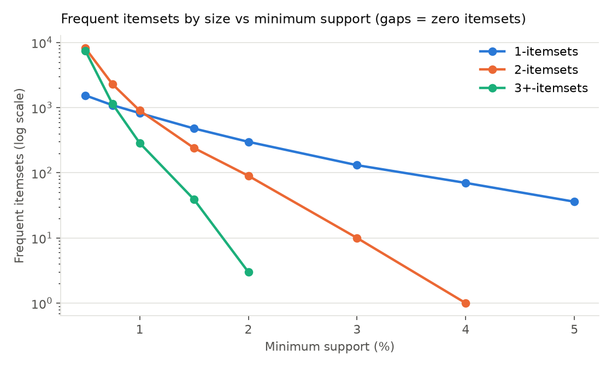
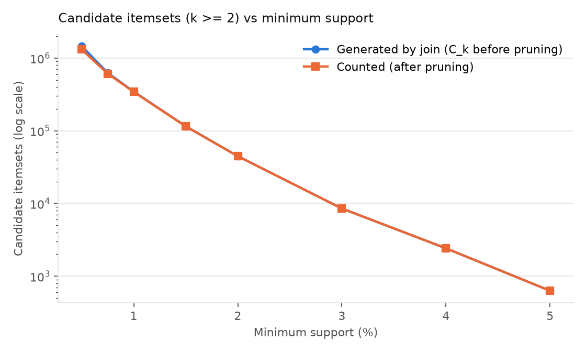
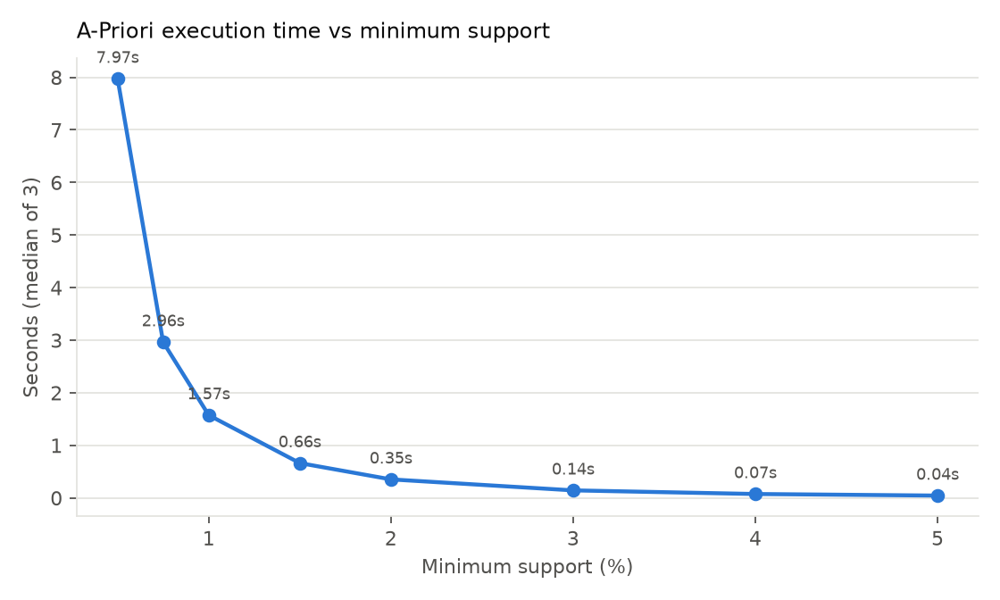
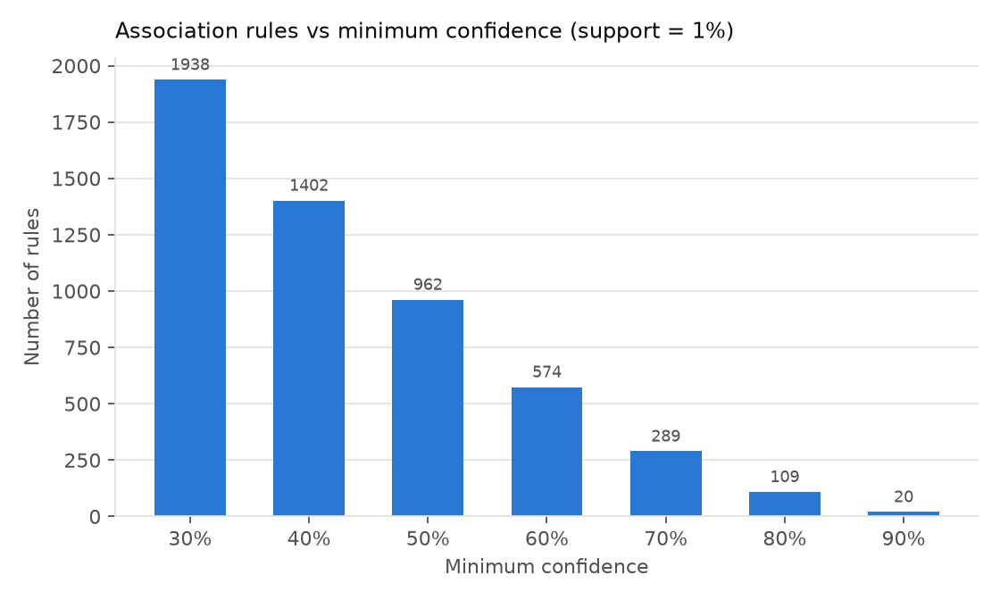
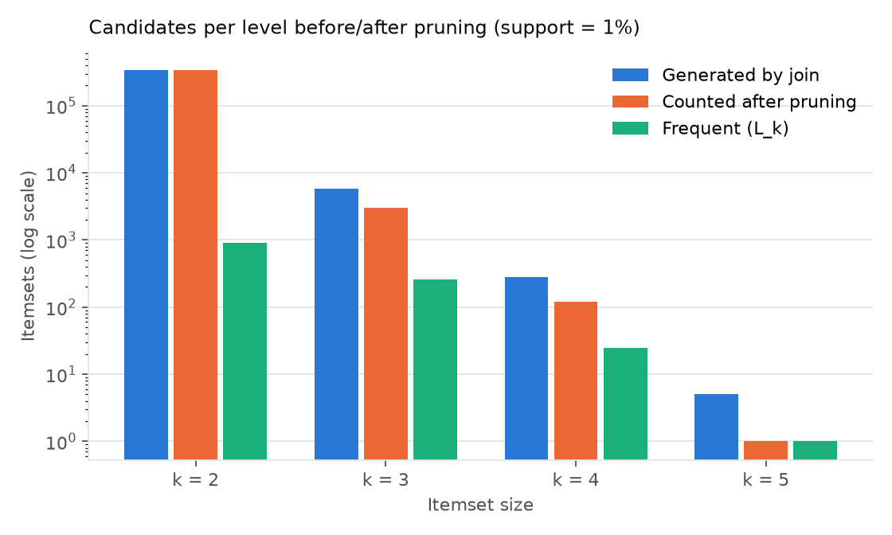
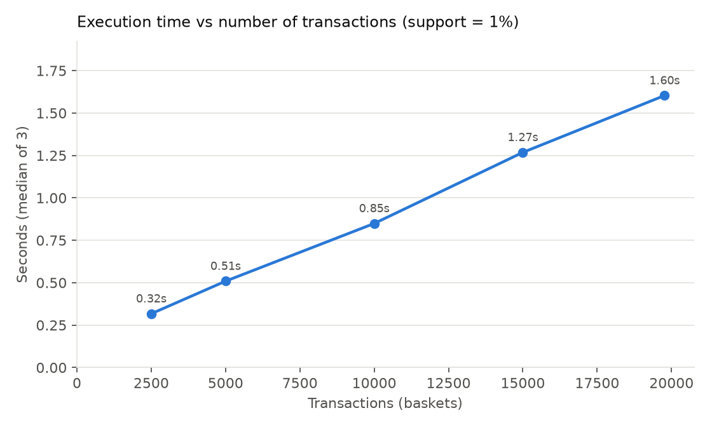
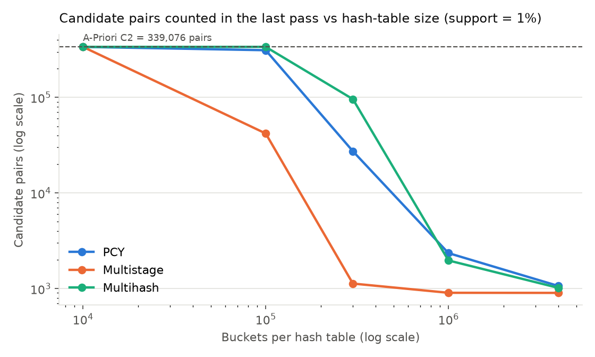
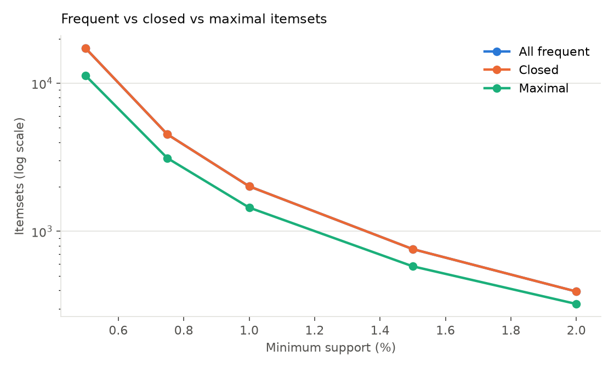
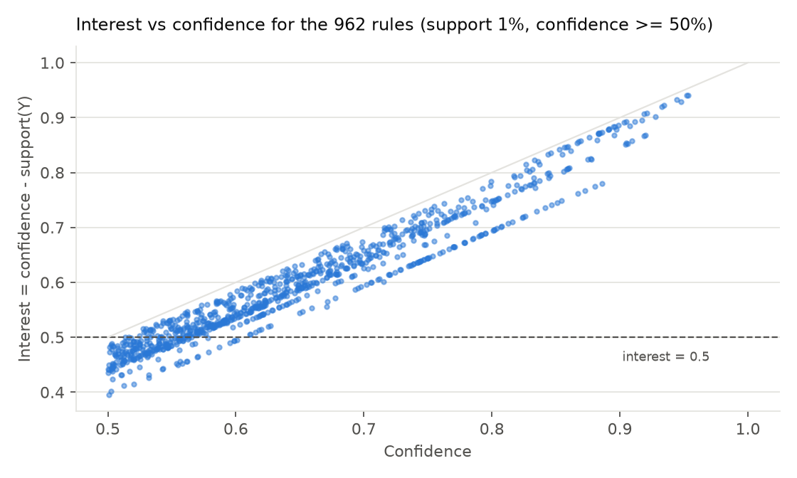

# Mini Project Report: Frequent Itemsets and Association Rules

|  |  |
| --- | --- |
| **Name** | Mohammed Khalifah |
| **Student ID** | 481013386 |
| **Course** | CSD 5113 – Big Data Mining |
| **Assignment** | Assignment 1 – Mini Project on Frequent Itemsets and Association Rules (Chapter 6, CLO6) |
| **Project title** | Frequent Itemset Mining and Association Rule Analysis in Online Retail Transactions |
| **Semester** | Semester I, 2026–2027 |

This project mines 19,766 real online-retail invoices with a hand-written A-Priori algorithm and the hashing refinements from Chapter 6 (PCY, Multistage, Multihash). At the reference setting (support 1%, confidence 50%) it finds 2,013 frequent itemsets and 962 association rules. PCY with 1,000,000 buckets returns the same 902 frequent pairs as A-Priori while counting 144 times fewer candidate pairs.

## 1. Mini Project Description

### 1.1 Objective

The project finds groups of products that customers buy together in a real online shop and turns them into rules of the form "if a basket contains X, it probably also contains Y". A second goal is to make the inside of the Chapter 6 algorithms visible: how many candidates each pass creates, how many pruning or hashing removes, and how the thresholds change the output and the running time.

### 1.2 Problem being addressed

An online retailer stores every order as an invoice. Over one year there are tens of thousands of invoices and thousands of products, so nobody can read them by hand to see which products sell together. That knowledge is useful for product bundles, "customers also bought" suggestions, catalogue layout and stock planning.

Given N baskets, the task is to:

1. find every itemset whose support is at least a minimum support s;
2. generate every rule X → Y from those itemsets whose confidence is at least a minimum confidence c;
3. measure how s, c, the hash-table size and the number of baskets change the output and the cost.

### 1.3 Dataset used

The **Online Retail** dataset from the UCI Machine Learning Repository (Chen, 2015; CC BY 4.0). It has 541,909 invoice lines from a UK online giftware shop, 1 Dec 2010 – 9 Dec 2011, with 8 columns: InvoiceNo, StockCode, Description, Quantity, InvoiceDate, UnitPrice, CustomerID, Country.

| Property (after cleaning) | Value |
| --- | --- |
| Baskets (invoices) | 19,766 |
| Distinct items (products) | 3,749 |
| Item occurrences (sum of basket sizes) | 513,563 |
| Mean / median basket size | 25.98 / 15 items |
| Largest basket | 1,100 items |
| Pairs generated from all baskets | 28,002,911 |
| Density of the basket × item matrix | 0.69% |

### 1.4 Why frequent-itemset mining is suitable

The data matches the market-basket model of Chapter 6 exactly: a large set of items, a large set of baskets, and each basket a small subset of the items (median 15 of 3,749). The business question "which products are bought together?" is the question frequent-itemset mining answers. No labels are needed, the patterns are easy to read, and support and confidence give a clear measure of strength.

The data is also big enough that the Chapter 6 techniques are needed rather than optional. There are 7,025,626 possible pairs and 8.8 billion possible triples of products, so counting every combination is impossible. Even pairs alone would need 28 MB of counters if every item were kept.

### 1.5 What is an item?

An **item** is one distinct product, identified by its StockCode and named by one standardised description, for example `REGENCY CAKESTAND 3 TIER`. Inside the algorithms each item is an integer id from 0 to 3,748, assigned in alphabetical order, as Chapter 6 recommends.

### 1.6 What is a basket / transaction?

A **basket** is one invoice (one customer order). It is the *set* of distinct products on that invoice. Quantity, price and line order are ignored, and a product listed on two lines of the same invoice counts once.

Example: invoice 536365, the first in the file, becomes the basket {CREAM CUPID HEARTS COAT HANGER, GLASS STAR FROSTED T-LIGHT HOLDER, KNITTED UNION FLAG HOT WATER BOTTLE, RED WOOLLY HOTTIE WHITE HEART., SET 7 BABUSHKA NESTING BOXES, WHITE HANGING HEART T-LIGHT HOLDER, WHITE METAL LANTERN}.

## 2. Selected Concepts from Chapter 6

The project implements and measures six concepts from Chapter 6 of *Mining of Massive Datasets* (Leskovec, Rajaraman, Ullman). Together they cover every topic in the lecture slides: the model, rules and interest, A-Priori, pair counting in memory, PCY with its two refinements, and compact output.

### 2.1 Market-basket model, support and frequent itemsets

**Textual.** The market-basket model sees the data as a many-to-many relation between *items* and *baskets*. Each basket is a small set of items. The model only asks "is item i in basket b?" and ignores quantity, price and order. An *itemset* is any set of items. Its *support* is how many baskets contain all of its items. Given a threshold s, an itemset is *frequent* if its support is at least s.

**Mathematical.** For an itemset I and the set of baskets B with |B| = N:

$$
\sigma(I) = \left|\{\, b \in B : I \subseteq b \,\}\right| \qquad support(I) = \frac{\sigma(I)}{N}
$$

The relative threshold s is turned into a whole number of baskets:

$$
minCount = \lceil s \cdot N \rceil, \qquad I \text{ is frequent} \iff \sigma(I) \ge minCount
$$

For N = 19,766 and s = 1%, minCount = ⌈197.66⌉ = 198 baskets.

**Example from the data.** JUMBO BAG RED RETROSPOT is in 2,089 baskets (support 10.57%). The pair {JUMBO BAG PINK POLKADOT, JUMBO BAG RED RETROSPOT} is in 825 baskets (4.17%). It is frequent at s = 1% and s = 4%, but not at s = 5%.

### 2.2 Association rules: confidence, interest and lift

**Textual.** A rule I → j says "if a basket contains all of I, it is likely to contain j". Confidence measures how often that is true. A rule can have high confidence only because j is popular in every basket. *Interest* removes that effect by subtracting how common j already is. The slides call a rule interesting when its interest is far from 0, usually above 0.5. Lift is a related ratio measure from the literature that is also reported.

**Mathematical.**

$$
conf(I \rightarrow j) = \frac{\sigma(I \cup \{j\})}{\sigma(I)} \qquad interest(I \rightarrow j) = conf(I \rightarrow j) - \frac{\sigma(\{j\})}{N} \qquad lift(I \rightarrow j) = \frac{conf(I \rightarrow j)}{\sigma(\{j\})/N}
$$

The support of a rule is the support of I ∪ {j}. Interest 0 (lift 1) means j appears in baskets with I exactly as often as in baskets in general.

**Lecture example (slide 14), reproduced by the code.** With baskets B1…B8, the rule {m, b} → c has confidence 2/4 = 0.5. Item c is in 5/8 of baskets, so interest = 0.5 − 0.625 = −0.125. The rule is not interesting. The unit test `test_slide_example_confidence_and_interest` checks these exact numbers.

**Example from the data.** σ(PINK POLKADOT bag) = 1,218, σ(RED RETROSPOT bag) = 2,089, σ(both) = 825:

- conf(PINK → RED) = 825 / 1,218 = 67.7%, interest = 0.677 − 0.106 = 0.572
- conf(RED → PINK) = 825 / 2,089 = 39.5%, interest = 0.395 − 0.062 = 0.333
- lift = 6.41 in both directions

**Algorithmic (rule generation, slide 16).** For every frequent itemset I with |I| ≥ 2 and every non-empty proper subset A ⊂ I, output A → I \\ A if its confidence is at least c. Because I is frequent, A and I \\ A are frequent too, so all their counts are already known and no new pass over the data is needed.

### 2.3 The A-Priori algorithm, monotonicity and candidate pruning

**Textual.** A-Priori finds the frequent itemsets one size at a time and makes one pass over the data per size. Its key idea is monotonicity: if a set appears in at least s baskets, so does every subset. Turned around, if any subset of a candidate is not frequent, the candidate cannot be frequent, so it is removed *before* it is counted.

**Mathematical.**

$$
J \subseteq I \;\Rightarrow\; \sigma(J) \ge \sigma(I) \qquad\Longrightarrow\qquad \exists\, J \subset C,\ |J| = k-1,\ J \notin L_{k-1} \;\Rightarrow\; C \notin L_k
$$

C\_k is the set of candidate k-itemsets and L\_k is the set of truly frequent k-itemsets.

**Algorithmic.**

```
APRIORI(baskets, s)
  minCount <- ceil(s * N)
  Pass 1:  count every item;  L1 <- items with count >= minCount
  k <- 2
  while L(k-1) is not empty:
     JOIN : join two itemsets of L(k-1) that share their first k-2 items -> Ck
     PRUNE: drop c in Ck if any (k-1)-subset of c is not in L(k-1)
     COUNT: one pass over the baskets, count every c left in Ck
     FILTER: Lk <- { c in Ck : count(c) >= minCount }
     k <- k + 1
  return L1 U L2 U ...
```

**Example from the data (s = 2%, minCount = 396).** The join created {GREEN REGENCY TEACUP AND SAUCER, PINK REGENCY TEACUP AND SAUCER, REGENCY CAKESTAND 3 TIER}. Its subset {PINK REGENCY TEACUP AND SAUCER, REGENCY CAKESTAND 3 TIER} is in only 392 baskets, so the triple can be in at most 392 < 396 baskets. It was removed without being counted.

### 2.4 Counting pairs in main memory: triangular matrix vs triples

**Textual.** Pairs are usually the hardest step, because there are many of them and main memory limits how many counters can be kept. Chapter 6 gives two ways to store pair counts. A *triangular matrix* is one flat array with a 4-byte counter for every pair {i, j} with i < j. A *table of triples* \[i, j, count\] uses 12 bytes, but only for pairs that actually occur. For A-Priori pass 2 the frequent items are re-numbered 1…m, so the matrix needs only m(m−1)/2 counters instead of one for every pair of all n items.

**Mathematical.** In the order {1,2}, {1,3}, …, {1,n}, {2,3}, …, pair {i, j} is stored at position

$$
k(i, j) = (i - 1)\left(n - \frac{i}{2}\right) + j - i, \qquad 1 \le i < j \le n
$$

$$
Mem_{triangular} = 4 \cdot \binom{m}{2} \text{ bytes} \qquad Mem_{triples} = 12 \cdot P_{occ} \text{ bytes}
$$

Triples win only when fewer than 1/3 of the possible pairs occur, i.e. when P\_occ < m(m−1)/6.

*Note on the slide formula.* Slides 28–29 write the position as (i − 1)(n − i/2) + j − 1. That is correct only for i = 1. For n = 4 and pair {2,3} it gives 5, but the correct position is 4. The code uses the textbook form (… + j − i). The test `test_triangular_index_is_a_bijection` checks that every pair gets a unique position from 1 to n(n−1)/2.

### 2.5 PCY, Multistage and Multihash (hash-based candidate reduction)

**Textual.** In pass 1 of A-Priori most of the memory sits unused. PCY (Park–Chen–Yu) uses it for a hash table of bucket counters. Every pair in every basket is hashed to a bucket, and that bucket's counter goes up by one. A bucket whose total is below s cannot contain a frequent pair. Between the passes the counters become a bit-vector (1 bit per bucket, 1/32 of the memory). In pass 2 a pair is counted only if both of its items are frequent **and** it hashes to a frequent bucket.

- **Multistage** adds a middle pass. Only pairs that qualify under PCY are rehashed, with a second independent hash function, into a second table. Fewer pairs land there, so fewer buckets become frequent by accident. The final pass checks both bit-vectors. That makes 3 passes.
- **Multihash** uses two independent hash tables, each half the size, in pass 1, and checks both in pass 2. That keeps 2 passes. The risk is that halving the buckets doubles the average bucket count.

**Mathematical.** The hash functions are h\_t(i, j) = ((a\_t·i + b\_t·j + c\_t) mod p) mod B, with p = 2³¹ − 1. A pair {i, j} is counted in the last pass only if:

$$
\sigma(\{i\}) \ge s \;\wedge\; \sigma(\{j\}) \ge s \;\wedge\; bitmap_1[h_1(i,j)] = 1 \;\left(\wedge\; bitmap_2[h_2(i,j)] = 1\right)
$$

If P pair occurrences are hashed into B buckets, the average bucket count is P / B. Hashing removes candidates only when most buckets stay below s, that is when P / B is well below s. Because the pass-2 counts must be stored as 12-byte triples, PCY beats A-Priori with a triangular matrix only if it removes about 2/3 of the candidate pairs.

**Algorithmic (PCY).**

```
Pass 1:  for each basket:
             for each item: itemCount[item] += 1
             for each pair {i,j}: bucket[h(i,j)] += 1
Between: bitmap[b] <- (bucket[b] >= s);  frequentItems <- {i : itemCount[i] >= s}
Pass 2:  for each basket, for each pair {i,j}:
             if i, j in frequentItems and bitmap[h(i,j)] = 1: count[{i,j}] += 1
         L2 <- { {i,j} : count[{i,j}] >= s }
```

### 2.6 Compacting the output: maximal and closed itemsets

**Textual.** A low support threshold can produce tens of thousands of itemsets. A frequent itemset is *maximal* if no immediate superset is frequent. The maximal sets alone tell you which sets are frequent, because every frequent set is a subset of one of them. An itemset is *closed* if no immediate superset has the same count. Closed sets keep the exact counts as well.

**Mathematical.**

$$
I \text{ maximal} \iff I \in F \;\wedge\; \forall x \notin I:\ I \cup \{x\} \notin F \qquad I \text{ closed} \iff \forall x \notin I:\ \sigma(I \cup \{x\}) < \sigma(I)
$$

**Lecture example (slide 19), reproduced by the code.** With s = 3: A(4), B(5), C(3), AB(4), BC(3). Maximal = {AB, BC}. Closed (frequent) = {B, AB, BC}. A is not closed because AB has the same count of 4.

## 3. Mini Project Design and Algorithms

The pipeline is: raw Excel → cleaning → baskets → integer encoding → A-Priori (or PCY / Multistage / Multihash for pairs) → association rules → experiments → tables, figures and a Flask dashboard. Every algorithm is written by hand in Python. No mining library such as mlxtend is used.

| Module | Role |
| --- | --- |
| `src/preprocessing.py` | data-quality checks, 11 cleaning steps, basket construction |
| `src/apriori.py` | A-Priori: join, prune, count, filter, per-level statistics |
| `src/association_rules.py` | rules X → Y with support, confidence, lift and interest |
| `src/pcy.py` | triangular matrix, PCY, Multistage, Multihash |
| `src/compact_output.py` | maximal and closed frequent itemsets |
| `src/experiments.py` | experiments 1–4 (support, confidence, pruning, scalability) |
| `src/chapter6_experiments.py` | experiments 5–9 (lecture examples, memory, hashing, compact output, interest) |
| `app.py`, `templates/`, `static/` | Flask JSON API and interactive dashboard |
| `tests/` | 35 unit tests, including brute-force cross-checks |

### 3.1 Data representation

- Item names are sorted alphabetically and mapped to integer ids 0–3,748 (`encode_transactions`). Integers are the compact form Chapter 6 recommends.
- Each basket is a **sorted tuple of integer ids**. Every itemset is also a sorted tuple, which is hashable. So candidate counts live in a Python dictionary (a hash table keyed by the itemset), the join is a simple prefix comparison, and `itertools.combinations` on a sorted basket yields k-subsets ready to look up.
- For the hashing algorithms, each pair {i, j} with i < j becomes a 64-bit code i·n + j. Pair counts in the final pass are stored as (code, count) entries, which are the "triples" of Chapter 6.
- For the triangular matrix, the frequent items are re-numbered 1…m and counts live in a flat numpy array of m(m−1)/2 integers.

### 3.2 Preprocessing

Data-quality problems were measured first, then fixed in 11 logged steps:

| Step | Rows removed / changed | Reason |
| --- | --- | --- |
| 1. Remove exact duplicate rows | 5,268 removed | data-entry duplicates add no new purchase |
| 2. Remove cancelled invoices ("C…") | 9,251 removed | returns are not purchases |
| 3. Remove non-standard invoices ("A…") | 3 removed | bad-debt adjustments |
| 4. Remove rows with no description | 1,454 removed | the item cannot be identified |
| 5. Remove Quantity ≤ 0 | 474 removed | stock corrections (damaged, lost) |
| 6. Remove UnitPrice ≤ 0 | 582 removed | free or internal adjustment lines |
| 7. Remove non-product codes (POST, DOT, M, fees, vouchers) | 2,337 removed | postage would create rules like {X} → {POSTAGE} |
| 8. Standardise text (trim, collapse spaces, upper-case) | 126,548 changed | the same product looked like different items |
| 9. One canonical description per StockCode | 6,555 changed | some codes had several spellings |
| 10. Appropriateness filter (alcohol/smoking keywords) | 3,442 removed | out-of-scope products, listed in `excluded_products.csv` |
| 11. Collapse repeated items in an invoice | 5,535 removed | a basket is a set |

The result is 513,563 cleaned lines grouped into 19,766 baskets over 3,749 items. Rows with no CustomerID were kept, because the invoice still describes a real basket. 1,508 single-item baskets were also kept. They have no pairs, but they belong in the N of the support formula.

### 3.3 Candidate generation

- **C1** = every distinct item (3,749).
- **C2** = every pair of frequent items. A-Priori generates C(m, 2) of them. PCY, Multistage and Multihash keep only the pairs that also hash to frequent buckets.
- **Ck, k ≥ 3**: the *join* step groups L(k−1) by its first k−2 items and joins every two itemsets with the same prefix. For example, {A,B} and {A,C} give {A,B,C}. The *prune* step then checks the k−2 subsets the join did not already guarantee, and drops the candidate if any is missing from L(k−1).
- The prefix join is cheaper than the L(k−1) × L1 construction shown on slide 36. On the slide-17 baskets it creates 2 candidate triples instead of 4, and pruning then removes 1, which leaves the same L3 = {b, c, m}.

### 3.4 Counting

Each level makes **one pass** over the baskets (`count_candidates`):

1. Items that appear in no candidate are dropped from the basket first.
2. For a normal basket, its k-subsets are listed and each is looked up in the candidate hash table.
3. For the few very large wholesale baskets (up to 1,100 items), listing every k-subset would cost more than checking each candidate. So the code compares C(|t|, k) with |Ck| and uses whichever is cheaper. Both give the same counts, and a unit test checks this.

The hashing algorithms stream the baskets in chunks of 2,000 and turn each basket into its pairs as it is read. Pairs are generated, not stored, as Chapter 6 describes. Each pass re-reads the baskets.

### 3.5 Minimum support threshold

The thresholds were chosen from the data, not copied from textbook examples. The best-selling item is in only 11.46% of baskets, so textbook values of 20–50% would return nothing. Above 5% no pair is frequent. Below 0.5% there are more than 1.3 million candidates. The support sweep therefore covers **0.5%, 0.75%, 1%, 1.5%, 2%, 3%, 4%, 5%**. The reference value is **1% (minCount = 198 baskets)**. It runs in under 2 seconds but still gives itemsets up to size 5.

### 3.6 Frequent itemsets

L\_k is the set of candidates whose count is at least minCount (`filter_frequent`). All levels are merged into one dictionary from itemset to count. The run stops when L\_k is empty. At 1% the result is 824 + 902 + 261 + 25 + 1 = **2,013 frequent itemsets**, and the largest has 5 items.

### 3.7 Association rules and the confidence threshold

`generate_rules(result, c)` uses every frequent itemset of size ≥ 2 and every non-empty proper subset of it as the antecedent. It computes support, confidence, lift and interest from the stored counts, with no new pass over the data. Antecedent and consequent are always disjoint. The confidence sweep covers **30%–90% in steps of 10%**, and the reference value is **50%**: Y must be in at least half of the baskets that contain X.

### 3.8 Hashing, sampling and other techniques

| Technique | Used? | How |
| --- | --- | --- |
| Hash table for candidate counts | Yes | Python dictionary keyed by the sorted itemset tuple |
| Triangular matrix with re-numbering | Yes | A-Priori pass 2 over the m frequent items, checked against the dictionary counts |
| PCY bucket hashing + bit-vector | Yes | 10,000 to 4,000,000 buckets, h(i,j) = ((a·i + b·j + c) mod p) mod B |
| Multistage (2 independent hashes, 3 passes) | Yes | same bucket sizes as PCY |
| Multihash (2 half-size tables, 2 passes) | Yes | same total memory as PCY |
| Random sampling | Yes, for scalability only | nested random samples of 2,500–19,766 baskets, seed 42 |
| SON / MapReduce, Toivonen | No | the data fits in memory on one machine; these belong to the later part of the chapter, which is not in this lecture |

## 4. Demonstration of Concepts

Each concept is shown working on two inputs: the lecture's own toy baskets, where the answer can be checked by hand, and the real 19,766 invoices. All numbers below are printed by the project code (`results/json/analysis_summary.json`, `results/json/chapter6_summary.json`).

### 4.1 A-Priori on the lecture example (slides 17 and 36)

Baskets: {m,c,b}, {m,p,j}, {m,c,b,n}, {c,j}, {m,p,b}, {m,c,b,j}, {c,b,j}, {b,c}. Support threshold s = 3 baskets.

| Level | Candidates C\_k | Pruned | Counted | Frequent L\_k |
| --- | --- | --- | --- | --- |
| k = 1 | {b} {c} {j} {m} {n} {p} | 0 | 6 | {b} {c} {j} {m} |
| k = 2 | all 6 pairs of {b, c, j, m} | 0 | 6 | {b,c} {b,m} {c,j} {c,m} |
| k = 3 | {b,c,m}, {c,j,m} | 1: {c,j,m}, because {j,m} is not frequent | 1 | {b,c,m} |

The output matches the slide: L3 = {b,c,m}. With confidence 0.75 the code also reproduces slide 17's rules: b → c (5/6), m → b (4/5), {b,m} → c (3/4), and {c,m} → b (3/3). It correctly rejects b → m (4/6) and {b,c} → m (3/5).

### 4.2 A-Priori on the real data: candidates and pruning per level (s = 1%)

| k | All possible k-itemsets C(3,749, k) | Generated by join | Pruned (monotonicity) | Counted | Frequent L\_k | Counted as % of all possible |
| --- | --- | --- | --- | --- | --- | --- |
| 1 | 3,749 | 3,749 | 0 | 3,749 | 824 | 100% |
| 2 | 7,025,626 | 339,076 | 0 | 339,076 | 902 | 4.83% |
| 3 | 8.78 × 10⁹ | 5,795 | 2,770 (47.8%) | 3,025 | 261 | 3.4 × 10⁻⁵ % |
| 4 | 8.22 × 10¹² | 284 | 165 (58.1%) | 119 | 25 | 1.4 × 10⁻⁹ % |
| 5 | 6.16 × 10¹⁵ | 5 | 4 (80.0%) | 1 | 1 | 1.6 × 10⁻¹⁴ % |

Three things show the theory working:

- **Monotonicity at k = 2.** Only pairs of the 824 frequent items are generated, which is 4.83% of all 7 million pairs. The other 95% are never considered.
- **Pruning at k ≥ 3.** The join step builds candidates from frequent itemsets, and the subset check then removes 47.8%–80% of them without any data scan.
- **Pairs are the bottleneck.** C2 (339,076) is 58 times larger than C3 (5,795) and takes 1.32 s of the 1.58 s run. This is the "k = 2 needs the most memory" observation on slide 37, and the reason PCY targets pairs.

Pruned candidates recorded by the code at s = 1% (minCount = 198):

| Candidate triple (removed) | Infrequent 2-subset | Count of that subset |
| --- | --- | --- |
| {6 RIBBONS RUSTIC CHARM, JAM MAKING SET PRINTED, SCANDINAVIAN REDS RIBBONS} | {JAM MAKING SET PRINTED, SCANDINAVIAN REDS RIBBONS} | 138 < 198 |
| {6 RIBBONS RUSTIC CHARM, JAM MAKING SET WITH JARS, SCANDINAVIAN REDS RIBBONS} | {JAM MAKING SET WITH JARS, SCANDINAVIAN REDS RIBBONS} | 114 < 198 |
| {6 RIBBONS RUSTIC CHARM, JUMBO BAG RED RETROSPOT, SCANDINAVIAN REDS RIBBONS} | {JUMBO BAG RED RETROSPOT, SCANDINAVIAN REDS RIBBONS} | 134 < 198 |

### 4.3 Frequent itemsets found (s = 1%)

| Frequent itemset | Size | Baskets | Support |
| --- | --- | --- | --- |
| {JUMBO BAG PINK POLKADOT, JUMBO BAG RED RETROSPOT} | 2 | 825 | 4.17% |
| {GREEN REGENCY TEACUP AND SAUCER, ROSES REGENCY TEACUP AND SAUCER} | 2 | 767 | 3.88% |
| {JUMBO BAG RED RETROSPOT, JUMBO STORAGE BAG SUKI} | 2 | 724 | 3.66% |
| {JUMBO BAG RED RETROSPOT, JUMBO SHOPPER VINTAGE RED PAISLEY} | 2 | 680 | 3.44% |
| {LUNCH BAG RED RETROSPOT, LUNCH BAG SUKI DESIGN} | 2 | 655 | 3.31% |
| {ALARM CLOCK BAKELIKE GREEN, ALARM CLOCK BAKELIKE RED} | 2 | 640 | 3.24% |
| {GREEN, PINK, ROSES REGENCY TEACUP AND SAUCER} | 3 | 541 | 2.74% |
| the single 5-itemset: {CHARLOTTE BAG PINK POLKADOT, CHARLOTTE BAG SUKI DESIGN, RED RETROSPOT CHARLOTTE BAG, STRAWBERRY CHARLOTTE BAG, WOODLAND CHARLOTTE BAG} | 5 | 204 | 1.03% |

The patterns are colour or design variants of the same product: jumbo bags, lunch bags, teacups, alarm clocks. Customers who buy one design often buy the matching set.

### 4.4 Association rules found (s = 1%, c = 50%)

| Rule X → Y | Confidence | Lift | Interest |
| --- | --- | --- | --- |
| {HERB MARKER PARSLEY, HERB MARKER THYME} → {HERB MARKER ROSEMARY} | 95.3% | 78.5 | 0.94 |
| {HERB MARKER BASIL, HERB MARKER THYME} → {HERB MARKER ROSEMARY} | 95.2% | 78.4 | 0.94 |
| {REGENCY TEA PLATE PINK, REGENCY TEA PLATE ROSES} → {REGENCY TEA PLATE GREEN} | 94.8% | 49.2 | 0.93 |
| {WOODEN HEART, WOODEN TREE CHRISTMAS SCANDINAVIAN} → {WOODEN STAR CHRISTMAS SCANDINAVIAN} | 92.8% | 35.8 | 0.90 |
| {HERB MARKER THYME} → {HERB MARKER ROSEMARY} | 93.3% | 76.8 | 0.92 |
| {JUMBO BAG PINK POLKADOT} → {JUMBO BAG RED RETROSPOT} | 67.7% | 6.4 | 0.57 |

Reading the first rule: 95.3% of baskets with parsley and thyme markers also contain the rosemary marker. Rosemary alone is in only 1.2% of baskets, so the interest is 0.94 and the rule is far from chance.

### 4.5 Effect of changing the support threshold (one itemset)

The teacup trio {GREEN, PINK, ROSES REGENCY TEACUP AND SAUCER} is in 541 baskets (2.74%):

| Min support | minCount | Trio frequent? | Why |
| --- | --- | --- | --- |
| 1% | 198 | Yes | 541 ≥ 198 |
| 2% | 396 | Yes | 541 ≥ 396 |
| 3% | 593 | No | its three pairs are still frequent (598–767 baskets), so A-Priori generates and counts the trio (the only C3 candidate left after pruning), then rejects it: 541 < 593 |

Across all thresholds, raising support from 0.5% to 5% cuts the frequent itemsets from 17,235 to 36 (Section 5.1).

### 4.6 Effect of changing the confidence threshold (one pair, two rules)

The frequent pair {JUMBO BAG PINK POLKADOT, JUMBO BAG RED RETROSPOT} (825 baskets) gives two rules:

| Rule | Confidence | Kept at c = 30%? | Kept at c = 50%? | Kept at c = 70%? |
| --- | --- | --- | --- | --- |
| PINK → RED | 825 / 1,218 = 67.7% | Yes | Yes | No |
| RED → PINK | 825 / 2,089 = 39.5% | Yes | No | No |

The same itemset gives rules of different strength, because confidence divides by the support of the left-hand side. Lift (6.41) is the same in both directions and does not depend on c.

### 4.7 PCY in action (s = 1%, 1,000,000 buckets)

| Step | What the code did | Result |
| --- | --- | --- |
| Pass 1, items | counted 3,749 items | 824 frequent items |
| Pass 1, pairs | hashed all 28,002,911 pair occurrences into 1,000,000 buckets | average bucket count 28.0 (< 198) |
| Between passes | bucket counts → bit-vector (125 KB instead of 4 MB of counters) | only 0.16% of buckets frequent |
| Pass 2 | counted pairs with both items frequent **and** bit = 1 | 2,352 candidate pairs (A-Priori: 339,076) |
| Filter | count ≥ 198 | 902 frequent pairs, identical to A-Priori; 1,450 false positives |

### 4.8 Maximal and closed itemsets on the real data (s = 1%)

| Itemset | Count | Frequent immediate supersets | Closed? | Maximal? |
| --- | --- | --- | --- | --- |
| {REGENCY TEA PLATE GREEN} | 381 | 5, the largest with count 319 | Yes | No |
| {REGENCY TEA PLATE GREEN, PINK} | 278 | {GREEN, PINK, ROSES} with 255 | Yes | No |
| {REGENCY TEA PLATE GREEN, PINK, ROSES} | 255 | none | Yes | Yes |
| {HERB MARKER ROSEMARY, THYME} | 221 | +BASIL (200), +PARSLEY (203) | Yes | No |

Each superset has a strictly smaller count, so all four are closed. Only the triple of tea plates has no frequent superset, so only it is maximal.

## 5. Evaluation

Nine experiments were run. Every hashing and triangular-matrix run returned exactly the same frequent pairs as A-Priori, so the methods differ only in cost, never in the answer. The minimum support threshold drives almost everything: it sets how many items survive pass 1, and the number of candidate pairs grows with the square of that number.

**Set-up.** Apple M2 Max, 32 GB RAM, macOS, Python 3.13.3, single process. Each time is the median of 3 runs with `time.perf_counter`. All counts are deterministic. Seconds vary slightly between machines.

### 5.1 Experiment 1: minimum support (0.5%–5%)



*Figure 1: Frequent itemsets by size vs minimum support (log scale).*



*Figure 2: Candidate itemsets (k ≥ 2) generated by the join and counted after pruning vs minimum support.*



*Figure 3: A-Priori execution time vs minimum support (median of 3 runs).*

On the log scales of Figures 1–3, itemsets, candidates and time all fall steadily. Each step up in support removes a constant share of the work, not a constant amount.

| Min support | minCount | Frequent 1-itemsets | Frequent 2-itemsets | Frequent 3+-itemsets | Largest itemset | Pruned candidates | Time (s) |
| --- | --- | --- | --- | --- | --- | --- | --- |
| 0.5% | 99 | 1,544 | 8,191 | 7,500 | 6 | 145,389 | 7.97 |
| 0.75% | 149 | 1,091 | 2,290 | 1,137 | 6 | 14,725 | 2.96 |
| 1% | 198 | 824 | 902 | 287 | 5 | 2,939 | 1.58 |
| 1.5% | 297 | 479 | 240 | 39 | 4 | 471 | 0.66 |
| 2% | 396 | 299 | 90 | 3 | 3 | 110 | 0.35 |
| 3% | 593 | 131 | 10 | 0 | 2 | 1 | 0.14 |
| 4% | 791 | 70 | 1 | 0 | 2 | 0 | 0.08 |
| 5% | 989 | 36 | 0 | 0 | 1 | 0 | 0.05 |

**Why the results change.**

- *Fewer patterns at higher support.* A higher threshold needs more baskets per itemset. Few product combinations are bought that often: the best item is in only 11.5% of baskets, and pair support drops quickly, so 5% leaves only 36 single items and no pairs.
- *Larger itemsets disappear first.* By monotonicity a k-itemset can be frequent only if all its subsets are. Each larger set must also pass the same absolute count, so the largest itemset shrinks from 6 items to 1 as s rises.
- *Cost follows the candidate pairs.* Time falls about 175× (7.97 s → 0.05 s) because C2 = C(|L1|, 2) depends on the square of the number of frequent items: 1,544 items give 1.19 million pairs, 36 items give 630.
- *Pruning matters more at low support.* With many frequent pairs, the join creates many triples whose other subsets are missing. 145,389 were removed at 0.5%, but none at 4–5%, where there is almost nothing to join.

### 5.2 Experiment 2: minimum confidence (30%–90%, support 1%)

| Min confidence | Rules | From pairs | From 3+-itemsets | Avg confidence | Avg lift | Min lift |
| --- | --- | --- | --- | --- | --- | --- |
| 30% | 1,938 | 755 | 1,183 | 52.1% | 13.7 | 2.65 |
| 40% | 1,402 | 455 | 947 | 58.6% | 15.2 | 3.53 |
| 50% | 962 | 252 | 710 | 65.0% | 17.0 | 4.74 |
| 60% | 574 | 122 | 452 | 71.7% | 19.3 | 5.69 |
| 70% | 289 | 59 | 230 | 78.8% | 23.3 | 6.24 |
| 80% | 109 | 28 | 81 | 85.9% | 35.7 | 7.58 |
| 90% | 20 | 4 | 16 | 92.2% | 50.5 | 16.82 |



*Figure 4: Number of association rules vs minimum confidence (support 1%).*

**Why the results change.**

- Confidence is applied *after* mining, so changing c costs no new pass over the data. The 2,013 frequent itemsets stay the same and only the filter on the rules changes.
- Rules fall by 97% (1,938 → 20) because most rules have confidence between 30% and 60%. Only tight product families, such as herb markers, tea plates and charlotte bags, reach 90%.
- Rules from 3+-itemsets survive better than rules from pairs (16 of 20 at 90%). A rule with a two-item antecedent, such as {PARSLEY, THYME} → ROSEMARY, has a smaller and more specific left-hand side, so its conditional probability is higher.
- Average and minimum lift rise with c, because strong rules here point to items that are rare on their own. Even at 30% the minimum lift is 2.65, so every rule is a positive association.

### 5.3 Experiment 3: candidate pruning

The per-level results are in Section 4.2. Across thresholds, the share of joined candidates that pruning removes grows with k: 47.8% at k = 3, 58.1% at k = 4 and 80% at k = 5 (support 1%). A k-itemset has k subsets that must all be frequent, so a larger candidate has more ways to fail. Without monotonicity, A-Priori would have to count 8.8 billion triples instead of 3,025.



*Figure 5: Candidates per level: generated by the join, counted after pruning, and frequent (support 1%, log scale).*

### 5.4 Experiment 4: scalability (nested random samples, support 1%)



*Figure 6: Execution time vs number of baskets (support 1%, nested random samples).*

Time rises almost in a straight line. Small samples cost slightly more per basket, because fixed per-run costs weigh more when there are few baskets.

| Baskets | minCount | Distinct items | Candidates counted (k ≥ 2) | Frequent itemsets | ms per 1,000 baskets |
| --- | --- | --- | --- | --- | --- |
| 2,500 | 25 | 3,311 | 346,796 | 2,801 | 126.6 |
| 5,000 | 50 | 3,514 | 346,328 | 2,312 | 101.9 |
| 10,000 | 100 | 3,667 | 337,273 | 2,029 | 84.9 |
| 15,000 | 150 | 3,721 | 346,423 | 2,072 | 84.6 |
| 19,766 | 198 | 3,749 | 342,221 | 2,013 | 81.1 |

**Why the results change.** Time grows linearly with the number of baskets, and the cost per 1,000 baskets even falls slightly. Support is a *fraction*, so minCount grows with N and the number of candidates stays near 340,000 at every size. Each pass therefore does the same amount of candidate work over more baskets, and fixed costs are spread more thinly. The smallest sample gives more frequent itemsets (2,801) because, with only 25 baskets needed, chance co-occurrences pass more easily. This is the same false-positive effect that Chapter 6's sampling methods have to correct for.

### 5.5 Experiment 6: triangular matrix vs triples

| Min support | Frequent items m | Triangular, all 3,749 items | Triangular, re-numbered m items | Pairs that occur | Triples (12 B each) | Better |
| --- | --- | --- | --- | --- | --- | --- |
| 0.5% | 1,544 | 28.1 MB | 4.77 MB | 1,154,145 (96.9%) | 13.85 MB | triangular |
| 1% | 824 | 28.1 MB | 1.36 MB | 337,984 (99.7%) | 4.06 MB | triangular |
| 2% | 299 | 28.1 MB | 0.18 MB | 44,539 (100%) | 0.53 MB | triangular |

**Why.** Re-numbering the frequent items cuts the matrix 6–160× compared with one counter for every pair of all items. Among frequent items almost every pair occurs at least once (97–100%), far above the 1/3 break-even point, so the triangular matrix wins here. Triples would win only on much sparser data. The triangular counts were checked against A-Priori's L2 at each threshold.

### 5.6 Experiment 7: PCY, Multistage and Multihash (support 1%)



*Figure 7: Candidate pairs counted in the last pass vs buckets per hash table for PCY, Multistage and Multihash (support 1%). The dashed line is A-Priori's C2.*

At 10,000 buckets every method counts all 337,984 pairs that occur, so hashing does nothing. From 300,000 buckets the lines drop steeply, and Multistage reaches the 902-pair floor first.

| Buckets per table | Frequent buckets: PCY | Multistage, table 2 | Multihash, each table | False positives: PCY / Multistage / Multihash | Pass-2 memory, PCY | Time PCY / MS / MH (s) |
| --- | --- | --- | --- | --- | --- | --- |
| 10,000 | 100% | 100% | 100% | 337,082 / 337,082 / 337,082 | 4.06 MB | 0.88 / 1.41 / 1.15 |
| 100,000 | 85.3% | 7.9% | 100% | 310,798 / 41,071 / 337,082 | 3.75 MB | 0.89 / 1.19 / 1.19 |
| 300,000 | 3.4% | 0.33% | 37% | 26,462 / 227 / 95,046 | 0.37 MB | 0.62 / 1.02 / 1.07 |
| 1,000,000 | 0.16% | 0.09% | 0.7–0.8% | 1,450 / 2 / 1,068 | 0.15 MB | 0.57 / 0.98 / 0.87 |
| 4,000,000 | 0.02% | 0.02% | 0.06–0.08% | 163 / 0 / 115 | 0.51 MB | 0.61 / 1.06 / 0.89 |

*Multihash splits the same memory into two tables of half the size. A false positive is a counted candidate pair that turns out not to be frequent.*

PCY at 1,000,000 buckets for different supports:

| Min support | A-Priori candidate pairs | PCY candidate pairs | Reduction | Frequent buckets |
| --- | --- | --- | --- | --- |
| 0.5% | 1,191,196 | 53,930 | 22× | 2.19% |
| 0.75% | 594,595 | 8,954 | 66× | 0.48% |
| 1% | 339,076 | 2,352 | 144× | 0.16% |
| 1.5% | 114,481 | 375 | 305× | 0.03% |
| 2% | 44,551 | 112 | 398× | 0.01% |

**Why the results change.**

- *Bucket size decides everything.* The 28 million pair occurrences are spread over B buckets, so the average bucket count is 28,002,911 / B. With 10,000 buckets that is 2,800, far above minCount = 198, so every bucket is frequent and PCY removes nothing. With 1,000,000 buckets it is 28, so only 0.16% of buckets reach 198 and 99.3% of candidate pairs are removed.
- *PCY beats A-Priori only past the 2/3 rule.* At 100,000 buckets PCY removes only 8% of candidates. Its 12-byte triples (3.75 MB) then use more memory than A-Priori's triangular matrix (1.36 MB). From 300,000 buckets it removes 92% and wins. This is the condition on slide 46.
- *Multistage removes the most.* Its second table receives only the 2,352 pairs that passed PCY, not 28 million, so almost no bucket becomes frequent by chance. It leaves 2 false positives at 1M buckets and 0 at 4M, at the cost of a third pass, which makes it the slowest.
- *Multihash depends on enough buckets.* Halving the table doubles the average count (560 at 100k), so every bucket is frequent and Multihash is worse than PCY. With enough buckets (1M) the two independent checks beat PCY (1,068 vs 1,450 false positives) in the same 2 passes. This is the risk described on slide 51.
- *Higher support helps hashing.* minCount grows while the average bucket count stays 28, so fewer buckets pass, and the reduction rises from 22× to 398×.
- *Time.* The hashing runs are vectorised with numpy and A-Priori's pair pass is pure Python (1.44 s for passes 1–2), so the seconds are not a fair speed comparison. The candidate counts and the memory are the fair comparison.

### 5.7 Experiment 8: maximal and closed itemsets

| Min support | Frequent itemsets | Closed | Maximal | Maximal as % of frequent |
| --- | --- | --- | --- | --- |
| 0.5% | 17,235 | 17,235 | 11,259 | 65.3% |
| 0.75% | 4,518 | 4,518 | 3,121 | 69.1% |
| 1% | 2,013 | 2,013 | 1,446 | 71.8% |
| 1.5% | 758 | 758 | 580 | 76.5% |
| 2% | 392 | 392 | 323 | 82.4% |



*Figure 8: Frequent, closed and maximal itemsets vs minimum support. The closed line lies exactly on the frequent line.*

**Why.** Every frequent itemset is closed. For I to be non-closed, *every* basket containing I would have to contain one extra product too, and with at least 99 baskets per frequent itemset in real retail data that never happened. Maximal itemsets cut the output by 18–35%. At 1%, 571 of the 824 frequent items are in no frequent pair, so they are maximal on their own. The other maximal sets are 650 pairs, 204 triples, 20 four-itemsets and 1 five-itemset. The saving is largest at low support, where long itemsets have many frequent subsets that the maximal set covers.

### 5.8 Experiment 9: interest of the rules (support 1%, confidence ≥ 50%)

| Interest band | Rules |
| --- | --- |
| below 0.3 | 0 |
| 0.3 – 0.5 | 201 |
| 0.5 – 0.7 | 597 |
| 0.7 – 1.0 | 164 |



*Figure 9: Interest vs confidence for the 962 rules (support 1%, confidence ≥ 50%); dashed line = interest 0.5.*

761 of the 962 rules (79%) pass the slide's "interest above 0.5" test, and none has negative interest. The lowest is {RED RETROSPOT SHOPPER BAG} → {JUMBO BAG RED RETROSPOT}: confidence 50.1%, interest 0.40. Its consequent is the second most popular product (10.6% of baskets), so part of its confidence is just popularity. Interest and confidence differ only by the consequent's support. In this data no product is in more than 11.5% of baskets, so interest is always within 0.115 of confidence and both measures rank rules almost the same way. On supermarket data, where milk or bread is in half of all baskets, the gap would be much larger.

## 6. Code Appendix

All Python source files are listed below in full. To reproduce every number in this report:

```
python -m venv .venv && source .venv/bin/activate
pip install -r requirements.txt          # pandas, numpy, openpyxl, matplotlib, Flask, pytest
python -m src.preprocessing              # raw Excel -> 19,766 baskets
python -m src.experiments                # experiments 1-4, figures 1-6
python -m src.chapter6_experiments       # experiments 5-9, figures 7-9
python -m pytest -q                      # 35 tests
python app.py                            # dashboard at http://127.0.0.1:5050
```

The dashboard front end (`templates/index.html`, `static/js/app.js`, `static/css/style.css`) is in the submitted folder. It only displays results, so it is not listed here.

### A.1 `src/apriori.py` – A-Priori (join, prune, count, filter)

```python
"""A manual, level-wise implementation of the A-Priori algorithm.

Terminology (Leskovec, Rajaraman & Ullman, *Mining of Massive Datasets*, Ch. 6):

* C_k : candidate k-itemsets that must be counted in pass k
* L_k : frequent k-itemsets, i.e. candidates whose support count >= the threshold

Each pass k performs four clearly separated steps:

1. **Join**   - combine pairs of frequent (k-1)-itemsets that share their first k-2 items.
2. **Prune**  - drop any candidate that has an infrequent (k-1)-subset (monotonicity).
3. **Count**  - one scan over the baskets to count the surviving candidates.
4. **Filter** - keep candidates with count >= minimum support count  ->  L_k.

The algorithm stops when L_k is empty (no candidates can be formed for k+1).

Items are mapped to integers before mining, and every itemset is stored as a *sorted
tuple of integers*. Sorted tuples make the join step a simple prefix comparison and make
itemsets hashable so they can be used as dictionary keys for counting.
"""

from __future__ import annotations

import math
import time
from collections import Counter, defaultdict
from dataclasses import asdict, dataclass, field
from itertools import combinations
from typing import Iterable, Sequence

Itemset = tuple[int, ...]


# ---------------------------------------------------------------------------
# Result containers
# ---------------------------------------------------------------------------
@dataclass
class LevelStats:
    """Statistics for one pass (level k) of A-Priori."""

    k: int
    candidates_generated: int      # |C_k| straight after the join step
    candidates_pruned: int         # removed by the subset (monotonicity) check
    candidates_counted: int        # |C_k| after pruning = candidates whose support is counted
    frequent_itemsets: int         # |L_k|
    seconds: float                 # wall-clock time for join + prune + count + filter


@dataclass
class AprioriResult:
    """Everything produced by one run of :func:`apriori`."""

    n_transactions: int
    min_support: float
    min_count: int
    item_names: list[str]
    frequent: dict[Itemset, int]                  # all frequent itemsets -> support count
    levels: list[LevelStats]
    pruned_examples: list[dict] = field(default_factory=list)
    total_seconds: float = 0.0

    # -- convenience accessors --------------------------------------------
    def support(self, itemset: Itemset) -> float:
        return self.frequent[itemset] / self.n_transactions

    def names(self, itemset: Iterable[int]) -> tuple[str, ...]:
        return tuple(self.item_names[i] for i in itemset)

    def count_by_size(self) -> dict[int, int]:
        sizes = Counter(len(s) for s in self.frequent)
        return dict(sorted(sizes.items()))

    @property
    def total_candidates(self) -> int:
        return sum(level.candidates_counted for level in self.levels)

    @property
    def total_pruned(self) -> int:
        return sum(level.candidates_pruned for level in self.levels)

    def top_itemsets(self, n: int = 20, min_size: int = 1) -> list[dict]:
        """The ``n`` frequent itemsets with the highest support (ties broken by name)."""
        rows = [(s, c) for s, c in self.frequent.items() if len(s) >= min_size]
        rows.sort(key=lambda sc: (-sc[1], self.names(sc[0])))
        return [
            {"itemset": list(self.names(s)), "size": len(s), "support_count": c,
             "support": round(c / self.n_transactions, 5)}
            for s, c in rows[:n]
        ]

    def level_table(self) -> list[dict]:
        return [asdict(level) | {"seconds": round(level.seconds, 4)} for level in self.levels]


# ---------------------------------------------------------------------------
# Step 0: transaction preparation
# ---------------------------------------------------------------------------
def encode_transactions(transactions: Sequence[Iterable[str]]) -> tuple[list[Itemset], list[str]]:
    """Map item names to integer ids (alphabetical order) and each basket to a sorted id tuple.

    Integer ids are the compact basket representation recommended in MMDS §6.2.2.
    """
    item_names = sorted({item for t in transactions for item in t})
    index = {name: i for i, name in enumerate(item_names)}
    encoded = [tuple(sorted({index[item] for item in t})) for t in transactions]
    return encoded, item_names


def min_support_count(min_support: float, n_transactions: int) -> int:
    """Convert a relative threshold s into an absolute count: ceil(s * N).

    An itemset I is frequent when support_count(I) / N >= s, i.e. support_count(I) >= s * N.
    The small epsilon protects against floating-point results such as 0.01 * 300 = 3.0000000000000004.
    """
    if not 0 < min_support <= 1:
        raise ValueError("min_support must be in (0, 1]")
    return max(1, math.ceil(min_support * n_transactions - 1e-9))


# ---------------------------------------------------------------------------
# Pass 1: frequent single items
# ---------------------------------------------------------------------------
def count_item_support(encoded: Sequence[Itemset]) -> Counter:
    """Support count of every individual item (C_1): one scan over the baskets."""
    counts: Counter = Counter()
    for basket in encoded:
        counts.update(basket)
    return counts


def frequent_1_itemsets(item_counts: Counter, min_count: int) -> dict[Itemset, int]:
    """L_1: single items whose support count reaches the threshold."""
    return {(item,): c for item, c in item_counts.items() if c >= min_count}


# ---------------------------------------------------------------------------
# Pass k >= 2: candidate generation (join + prune)
# ---------------------------------------------------------------------------
def apriori_join(prev_frequent: Iterable[Itemset]) -> list[Itemset]:
    """Join step: build C_k from L_{k-1}.

    Two frequent (k-1)-itemsets are joined when they agree on their first k-2 items
    (their "prefix"); the new candidate is the prefix plus both last items.
    Example (k=3): {A,B} and {A,C} share prefix {A}  ->  candidate {A,B,C}.
    For k=2 the prefix is empty, so every pair of frequent items is produced.
    """
    by_prefix: dict[Itemset, list[int]] = defaultdict(list)
    for itemset in prev_frequent:
        by_prefix[itemset[:-1]].append(itemset[-1])

    candidates: list[Itemset] = []
    for prefix, last_items in by_prefix.items():
        last_items.sort()
        for a, b in combinations(last_items, 2):     # a < b, so the result stays sorted
            candidates.append(prefix + (a, b))
    return candidates


def find_infrequent_subset(candidate: Itemset, prev_frequent: set[Itemset]) -> Itemset | None:
    """Return one (k-1)-subset of ``candidate`` that is NOT frequent, or None if all are.

    The two subsets obtained by dropping the last or second-to-last item are the ones the
    join step started from, so they are frequent by construction; the check therefore
    only needs to look at the subsets that drop one of the first k-2 items.
    """
    k = len(candidate)
    for drop in range(k - 2):
        subset = candidate[:drop] + candidate[drop + 1:]
        if subset not in prev_frequent:
            return subset
    return None


def prune_candidates(candidates: Iterable[Itemset], prev_frequent: set[Itemset],
                     examples: list[dict] | None = None, max_examples: int = 0
                     ) -> tuple[list[Itemset], int]:
    """Prune step (A-Priori / monotonicity property).

    If an itemset is frequent, every one of its subsets is frequent. Contrapositive: if
    ANY (k-1)-subset of a candidate is infrequent, the candidate cannot be frequent, so it
    is removed here *without ever counting it* in the data.

    Returns the surviving candidates and the number pruned. When ``examples`` is given,
    up to ``max_examples`` pruned candidates are stored together with the infrequent
    subset that justified removing them.
    """
    kept: list[Itemset] = []
    pruned = 0
    for cand in candidates:
        bad_subset = find_infrequent_subset(cand, prev_frequent)
        if bad_subset is None:
            kept.append(cand)
        else:
            # PRUNING HAPPENS HERE: cand has an infrequent subset -> cannot be frequent.
            pruned += 1
            if examples is not None and len(examples) < max_examples:
                examples.append({"candidate": cand, "infrequent_subset": bad_subset})
    return kept, pruned


def generate_candidates(prev_frequent: dict[Itemset, int], examples: list[dict] | None = None,
                        max_examples: int = 0) -> tuple[list[Itemset], int, int]:
    """C_k = prune(join(L_{k-1})). Returns (candidates, generated_by_join, pruned)."""
    joined = apriori_join(prev_frequent.keys())
    kept, pruned = prune_candidates(joined, set(prev_frequent), examples, max_examples)
    return kept, len(joined), pruned


# ---------------------------------------------------------------------------
# Pass k >= 2: support counting and filtering
# ---------------------------------------------------------------------------
def count_candidates(encoded: Sequence[Itemset], candidates: Sequence[Itemset], k: int) -> dict[Itemset, int]:
    """Count the support of each candidate k-itemset with one scan over the baskets.

    For each basket we first discard items that appear in no candidate (they cannot
    contribute). Then we use whichever of two equivalent strategies is cheaper:

    * enumerate the k-subsets of the basket and look each one up in the candidate hash
      table (cheap for ordinary baskets), or
    * test every candidate for containment in the basket (cheaper for the few very large
      wholesale baskets, where C(|basket|, k) would exceed the number of candidates).
    """
    counts: dict[Itemset, int] = dict.fromkeys(candidates, 0)
    if not counts:
        return counts
    relevant_items = {item for cand in candidates for item in cand}
    n_candidates = len(counts)

    for basket in encoded:
        items = [i for i in basket if i in relevant_items]   # stays sorted
        if len(items) < k:
            continue
        if math.comb(len(items), k) <= n_candidates:
            for subset in combinations(items, k):
                if subset in counts:
                    counts[subset] += 1
        else:
            basket_set = set(items)
            for cand in counts:
                if basket_set.issuperset(cand):
                    counts[cand] += 1
    return counts


def filter_frequent(counts: dict[Itemset, int], min_count: int) -> dict[Itemset, int]:
    """L_k: candidates whose support count is at least the minimum support count."""
    return {itemset: c for itemset, c in counts.items() if c >= min_count}


# ---------------------------------------------------------------------------
# Driver
# ---------------------------------------------------------------------------
def apriori(transactions: Sequence[Iterable[str]], min_support: float, max_k: int | None = None,
            max_pruned_examples: int = 5, encoded: tuple[list[Itemset], list[str]] | None = None
            ) -> AprioriResult:
    """Mine all frequent itemsets with support >= ``min_support``.

    Parameters
    ----------
    transactions : baskets, each an iterable of item names
    min_support : relative minimum support s, 0 < s <= 1
    max_k : optional maximum itemset size (None = run until L_k is empty)
    max_pruned_examples : how many pruned candidates to keep as evidence of pruning
    encoded : pre-computed output of :func:`encode_transactions` (saves time in experiments)
    """
    start = time.perf_counter()
    baskets, item_names = encoded if encoded is not None else encode_transactions(transactions)
    n = len(baskets)
    min_count = min_support_count(min_support, n)

    # ---- Pass 1: C_1 = all distinct items, L_1 = frequent items ----------
    t0 = time.perf_counter()
    item_counts = count_item_support(baskets)
    current = frequent_1_itemsets(item_counts, min_count)
    levels = [LevelStats(1, len(item_counts), 0, len(item_counts), len(current), time.perf_counter() - t0)]
    frequent: dict[Itemset, int] = dict(current)
    pruned_examples: list[dict] = []

    # ---- Passes k = 2, 3, ...: C_k from L_{k-1}, then count -> L_k -------
    k = 2
    while current and (max_k is None or k <= max_k):
        t0 = time.perf_counter()
        candidates, generated, pruned = generate_candidates(current, pruned_examples, max_pruned_examples)
        counts = count_candidates(baskets, candidates, k)
        current = filter_frequent(counts, min_count)
        frequent.update(current)
        if generated == 0:
            break   # L_{k-1} could not be joined: no level k exists
        levels.append(LevelStats(k, generated, pruned, len(candidates), len(current), time.perf_counter() - t0))
        k += 1

    result = AprioriResult(n, min_support, min_count, item_names, frequent, levels,
                           total_seconds=time.perf_counter() - start)
    result.pruned_examples = [
        {
            "candidate": list(result.names(ex["candidate"])),
            "infrequent_subset": list(result.names(ex["infrequent_subset"])),
            "infrequent_subset_count": _count_itemset(baskets, ex["infrequent_subset"]),
        }
        for ex in pruned_examples
    ]
    return result


def _count_itemset(encoded: Sequence[Itemset], itemset: Itemset) -> int:
    """Support count of a single itemset (used only to document pruned examples)."""
    target = set(itemset)
    return sum(1 for basket in encoded if target.issubset(basket))
```

### A.2 `src/association_rules.py` – rules with confidence, lift and interest

```python
"""Association-rule generation from the frequent itemsets found by :mod:`src.apriori`.

For a frequent itemset I and a non-empty proper subset X of I, the rule is
X -> Y with Y = I \\ X (so X and Y are always disjoint and neither is empty).

    support(X -> Y)    = support(X u Y)                     = count(I) / N
    confidence(X -> Y) = support(X u Y) / support(X)        = count(I) / count(X)
    lift(X -> Y)       = confidence(X -> Y) / support(Y)
    interest(X -> Y)   = confidence(X -> Y) - support(Y)     (MMDS §6.1.3)

Because of monotonicity every subset X and Y of a frequent itemset I is itself frequent,
so their counts are already stored in the A-Priori result and no extra data scan is needed.
"""

from __future__ import annotations

from dataclasses import dataclass
from itertools import combinations
from statistics import mean

from src.apriori import AprioriResult


@dataclass(frozen=True)
class AssociationRule:
    antecedent: tuple[str, ...]
    consequent: tuple[str, ...]
    support_count: int
    support: float
    confidence: float
    lift: float
    interest: float = 0.0          # confidence - support(consequent); 0 means independence

    def as_dict(self) -> dict:
        return {
            "antecedent": list(self.antecedent),
            "consequent": list(self.consequent),
            "support_count": self.support_count,
            "support": round(self.support, 5),
            "confidence": round(self.confidence, 4),
            "lift": round(self.lift, 3),
            "interest": round(self.interest, 4),
        }


def generate_rules(result: AprioriResult, min_confidence: float) -> list[AssociationRule]:
    """All rules X -> Y from frequent itemsets of size >= 2 with confidence >= ``min_confidence``.

    Rules are returned sorted by confidence, then lift (both descending).
    """
    if not 0 <= min_confidence <= 1:
        raise ValueError("min_confidence must be in [0, 1]")
    n = result.n_transactions
    rules: list[AssociationRule] = []

    for itemset, count in result.frequent.items():
        if len(itemset) < 2:
            continue
        # Every non-empty proper subset of the itemset can be an antecedent.
        for r in range(1, len(itemset)):
            for antecedent in combinations(itemset, r):
                consequent = tuple(i for i in itemset if i not in antecedent)   # disjoint by construction
                confidence = count / result.frequent[antecedent]
                if confidence < min_confidence:
                    continue
                consequent_support = result.frequent[consequent] / n
                rules.append(AssociationRule(
                    antecedent=result.names(antecedent),
                    consequent=result.names(consequent),
                    support_count=count,
                    support=count / n,
                    confidence=confidence,
                    lift=confidence / consequent_support,
                    interest=confidence - consequent_support,
                ))

    rules.sort(key=lambda r: (-r.confidence, -r.lift, r.antecedent, r.consequent))
    return rules


def rule_summary(rules: list[AssociationRule]) -> dict:
    """Aggregate statistics used in the confidence experiment."""
    if not rules:
        return {"rules": 0, "avg_confidence": None, "avg_lift": None,
                "max_confidence": None, "min_lift": None}
    return {
        "rules": len(rules),
        "avg_confidence": round(mean(r.confidence for r in rules), 4),
        "avg_lift": round(mean(r.lift for r in rules), 3),
        "max_confidence": round(max(r.confidence for r in rules), 4),
        "min_lift": round(min(r.lift for r in rules), 3),
    }
```

### A.3 `src/compact_output.py` – maximal and closed itemsets

```python
"""Compacting the output of A-Priori: maximal and closed frequent itemsets (MMDS §6.1, slides 18-19).

* An itemset is **maximal** if it is frequent and no immediate superset is frequent.
* An itemset is **closed** if no immediate superset has the same support count.
  Only frequent closed itemsets are reported here. A superset with the same count as a
  frequent itemset is itself frequent, so it is enough to look among the frequent itemsets.

Every frequent itemset is a subset of some maximal one (so maximal sets describe *which*
sets are frequent), and every frequent itemset's count equals the count of its smallest
closed superset (so closed sets keep the exact counts as well).
"""

from __future__ import annotations

from collections import defaultdict

Itemset = tuple[int, ...]


def immediate_supersets(frequent: dict[Itemset, int]) -> dict[Itemset, list[Itemset]]:
    """For every frequent itemset, its frequent supersets with exactly one more item."""
    supersets: dict[Itemset, list[Itemset]] = defaultdict(list)
    for itemset in frequent:
        if len(itemset) < 2:
            continue
        for drop in range(len(itemset)):
            subset = itemset[:drop] + itemset[drop + 1:]
            supersets[subset].append(itemset)   # subset is frequent by monotonicity
    return supersets


def maximal_and_closed(frequent: dict[Itemset, int]) -> tuple[set[Itemset], set[Itemset]]:
    """Return (maximal, closed) subsets of the frequent itemsets."""
    sup = immediate_supersets(frequent)
    maximal = {s for s in frequent if not sup.get(s)}
    closed = {s for s, c in frequent.items() if all(frequent[t] != c for t in sup.get(s, []))}
    return maximal, closed
```

### A.4 `src/pcy.py` – triangular matrix, PCY, Multistage, Multihash

```python
"""Memory-saving algorithms for frequent PAIRS from MMDS Chapter 6 (§6.2.2, §6.3).

This module complements :mod:`src.apriori`. A-Priori decides which pairs to count from
the frequent items alone; the algorithms here add hashing so that fewer pairs need a
counter in the pass that counts pairs:

* **Triangular matrix** (§6.2.2): pair counts kept in a 1-D array of n(n-1)/2 integers,
  after re-numbering the frequent items 1..m (the "trick" on the A-Priori slides).
* **PCY** (Park-Chen-Yu, §6.3.1): pass 1 also hashes every pair into a bucket and counts
  the bucket. A bucket whose count is below the threshold cannot hold a frequent pair,
  so pairs that hash there are not counted in pass 2.
* **Multistage** (§6.3.2): an extra pass rehashes only the pairs that survived PCY's
  conditions into a second, independent hash table -> fewer false-positive buckets.
* **Multihash** (§6.3.3): two independent hash tables (each half the size) in pass 1.

Every pass reads the baskets again, chunk by chunk, and expands each basket into its
pairs as it is read (MMDS §6.2.1). numpy is used only to make that expansion fast; the
logic of each pass is exactly the pseudocode in the comments.

All functions return the frequent pairs as well, so tests can check that every method
finds exactly the same L_2 as A-Priori: hashing only removes candidates that cannot be
frequent, it never changes the answer.
"""

from __future__ import annotations

import math
import time
from dataclasses import asdict, dataclass
from typing import Iterator, Sequence

import numpy as np

Itemset = tuple[int, ...]

PRIME = 2_147_483_647          # 2^31 - 1, modulus for the universal hash family
# Two independent hash functions h(i, j) = ((a*i + b*j + c) mod PRIME) mod B.
HASH_PARAMS = ((1_000_003, 7_919, 12_345), (40_503, 2_654_435, 98_765))


# ---------------------------------------------------------------------------
# Basket -> pairs, streamed one chunk of baskets at a time (one "pass")
# ---------------------------------------------------------------------------
_TRIU_CACHE: dict[int, tuple[np.ndarray, np.ndarray]] = {}


def _triu(n: int) -> tuple[np.ndarray, np.ndarray]:
    """Index arrays of all pairs (a < b) of positions 0..n-1 (cached by basket length)."""
    if n not in _TRIU_CACHE:
        _TRIU_CACHE[n] = np.triu_indices(n, k=1)
    return _TRIU_CACHE[n]


def iter_pairs(baskets: Sequence[Itemset], chunk: int = 2_000) -> Iterator[tuple[np.ndarray, np.ndarray]]:
    """One pass over the data: yield (i, j) arrays with i < j for every pair in every basket.

    Pairs are not stored in the file; like the nested loops in MMDS §6.2.1 they are
    generated from each basket as it is read.
    """
    for start in range(0, len(baskets), chunk):
        left, right = [], []
        for basket in baskets[start:start + chunk]:
            if len(basket) < 2:
                continue
            arr = np.asarray(basket, dtype=np.int64)        # baskets are sorted, so i < j
            a, b = _triu(len(arr))
            left.append(arr[a])
            right.append(arr[b])
        if left:
            yield np.concatenate(left), np.concatenate(right)


def pair_hash(i: np.ndarray, j: np.ndarray, n_buckets: int, which: int = 0) -> np.ndarray:
    """Bucket number of each pair {i, j} under hash function ``which`` (0 or 1)."""
    a, b, c = HASH_PARAMS[which]
    return ((a * i + b * j + c) % PRIME) % n_buckets


def count_items(baskets: Sequence[Itemset], n_items: int) -> np.ndarray:
    """Item counts (the A-Priori / PCY pass-1 item table)."""
    flat = np.fromiter((i for b in baskets for i in b), dtype=np.int64)
    return np.bincount(flat, minlength=n_items)


# ---------------------------------------------------------------------------
# Triangular matrix (MMDS §6.2.2)
# ---------------------------------------------------------------------------
def triangular_index(i: int, j: int, n: int) -> int:
    """1-based position of pair {i, j} (1 <= i < j <= n) in the triangular array.

    k = (i - 1)(n - i/2) + j - i   (MMDS 3rd ed., §6.2.2)

    Pairs are stored in the order {1,2}, {1,3}, ..., {1,n}, {2,3}, ..., {n-1,n}, so the
    array needs exactly n(n-1)/2 slots and no space for i >= j.
    """
    if not 1 <= i < j <= n:
        raise ValueError("need 1 <= i < j <= n")
    return int((i - 1) * (n - i / 2) + j - i)


def triangular_pair_counts(baskets: Sequence[Itemset], frequent_items: Sequence[int]
                           ) -> tuple[np.ndarray, dict[int, int]]:
    """A-Priori pass 2 with a triangular matrix over the RE-NUMBERED frequent items.

    The frequent items get new numbers 1..m (table ``new_id``), so the matrix needs only
    m(m-1)/2 counters instead of n(n-1)/2 for all n items. Returns the count array
    (index k-1 holds the count of the pair at position k) and the re-numbering table.
    """
    new_id = {old: new for new, old in enumerate(sorted(frequent_items), start=1)}
    m = len(new_id)
    lookup = np.zeros(max(frequent_items, default=0) + 1, dtype=np.int64)  # 0 = not frequent
    for old, new in new_id.items():
        lookup[old] = new
    counts = np.zeros(m * (m - 1) // 2, dtype=np.int64)
    for i, j in iter_pairs(baskets):
        keep = (i < len(lookup)) & (j < len(lookup))
        ni, nj = lookup[i[keep]], lookup[j[keep]]
        both = (ni > 0) & (nj > 0)
        ni, nj = ni[both], nj[both]                       # re-numbering keeps i < j
        k = (ni - 1) * (2 * m - ni) // 2 + nj - ni        # integer form of the formula
        counts += np.bincount(k - 1, minlength=len(counts))
    return counts, new_id


def triangular_frequent_pairs(counts: np.ndarray, new_id: dict[int, int], min_count: int) -> dict[Itemset, int]:
    """Read L_2 back out of the triangular array, translating to the original item ids."""
    old_of = {new: old for old, new in new_id.items()}
    m = len(new_id)
    out = {}
    for pos in np.nonzero(counts >= min_count)[0]:
        k = int(pos) + 1
        # invert k -> (i, j): walk the rows (m is small, so this is cheap)
        i, start = 1, 1
        while start + (m - i) <= k:
            start += m - i
            i += 1
        j = i + (k - start) + 1
        out[(old_of[i], old_of[j])] = int(counts[pos])
    return out


# ---------------------------------------------------------------------------
# PCY, Multistage, Multihash
# ---------------------------------------------------------------------------
@dataclass
class PairMiningStats:
    """What one run of a pair-mining algorithm did, for the report tables."""

    algorithm: str
    min_count: int
    n_buckets: int                 # total buckets over all hash tables
    passes: int
    frequent_items: int
    apriori_candidate_pairs: int   # C(m, 2): every pair of frequent items (A-Priori's C_2)
    occurring_frequent_item_pairs: int  # of those, the ones that occur in at least one basket
    candidate_pairs: int           # occurring pairs that pass ALL the algorithm's conditions
    frequent_buckets_pct: float    # share of buckets in the FIRST hash table with count >= min_count
    frequent_buckets_pct_table2: float | None  # same for the second table (Multistage/Multihash)
    avg_bucket_count: float        # pair occurrences hashed into the first table / its buckets
    frequent_pairs: int            # |L_2|
    false_positive_candidates: int # candidate pairs that turn out NOT to be frequent
    memory_pass2_bytes: int        # bitmaps + 12-byte triples for the counted candidates
    seconds: float

    def as_dict(self) -> dict:
        t2 = self.frequent_buckets_pct_table2
        return asdict(self) | {"frequent_buckets_pct": round(self.frequent_buckets_pct, 2),
                               "frequent_buckets_pct_table2": None if t2 is None else round(t2, 2),
                               "avg_bucket_count": round(self.avg_bucket_count, 1),
                               "seconds": round(self.seconds, 3)}


def _count_selected_pairs(baskets: Sequence[Itemset], n_items: int, keep_fn) -> dict[int, int]:
    """Final pass: count, as (pair code -> count) triples, only pairs for which keep_fn is True."""
    codes = []
    for i, j in iter_pairs(baskets):
        mask = keep_fn(i, j)
        codes.append(i[mask] * n_items + j[mask])
    if not codes:
        return {}
    uniq, cnt = np.unique(np.concatenate(codes), return_counts=True)
    return dict(zip(uniq.tolist(), cnt.tolist()))


def _finish(name, baskets, n_items, min_count, n_buckets, passes, item_freq, keep_fn,
            bucket_counts, start) -> tuple[PairMiningStats, dict[Itemset, int]]:
    counted = _count_selected_pairs(baskets, n_items, keep_fn)
    frequent = {(c // n_items, c % n_items): v for c, v in counted.items() if v >= min_count}
    seconds = time.perf_counter() - start    # the algorithm ends here; the rest is diagnostics
    # For comparison: occurring pairs whose two items are both frequent (A-Priori with triples).
    occurring = _count_selected_pairs(baskets, n_items, lambda i, j: item_freq[i] & item_freq[j])
    m = int(item_freq.sum())
    n_bitmaps = len(bucket_counts)
    bitmap_bytes = sum(math.ceil(len(t) / 8) for t in bucket_counts)
    first = bucket_counts[0]
    total_pair_occurrences = sum(len(i) for i, _ in iter_pairs(baskets))
    stats = PairMiningStats(
        algorithm=name, min_count=min_count, n_buckets=sum(len(t) for t in bucket_counts),
        passes=passes, frequent_items=m, apriori_candidate_pairs=math.comb(m, 2),
        occurring_frequent_item_pairs=len(occurring), candidate_pairs=len(counted),
        frequent_buckets_pct=100 * float((first >= min_count).mean()),
        frequent_buckets_pct_table2=(100 * float((bucket_counts[1] >= min_count).mean())
                                     if n_bitmaps > 1 else None),
        avg_bucket_count=total_pair_occurrences / len(first),
        frequent_pairs=len(frequent), false_positive_candidates=len(counted) - len(frequent),
        memory_pass2_bytes=bitmap_bytes + 12 * len(counted),
        seconds=seconds,
    )
    return stats, frequent


def pcy(baskets: Sequence[Itemset], n_items: int, min_count: int, n_buckets: int
        ) -> tuple[PairMiningStats, dict[Itemset, int]]:
    """PCY: 2 passes.

    Pass 1   FOR each basket: add 1 to each item's count;
                              FOR each pair: hash it to a bucket, add 1 to that bucket.
    Between  bitmap[b] = 1 iff bucket b's count >= s ; frequent items = count >= s.
    Pass 2   count pair {i, j} only if i and j are frequent AND bitmap[h(i, j)] = 1.
    """
    start = time.perf_counter()
    item_freq = count_items(baskets, n_items) >= min_count
    buckets = np.zeros(n_buckets, dtype=np.int64)
    for i, j in iter_pairs(baskets):                                   # pass 1 (pairs part)
        buckets += np.bincount(pair_hash(i, j, n_buckets), minlength=n_buckets)
    bitmap = buckets >= min_count                                      # between passes
    keep = lambda i, j: item_freq[i] & item_freq[j] & bitmap[pair_hash(i, j, n_buckets)]  # noqa: E731
    return _finish("PCY", baskets, n_items, min_count, n_buckets, 2, item_freq, keep, [buckets], start)


def multistage(baskets: Sequence[Itemset], n_items: int, min_count: int, n_buckets: int
               ) -> tuple[PairMiningStats, dict[Itemset, int]]:
    """Multistage: 3 passes. Pass 1 = PCY pass 1 (hash h1).

    Pass 2   rehash with an INDEPENDENT h2 only the pairs that qualify for PCY's pass 2
             (both items frequent, h1-bucket frequent) -> bitmap 2.
    Pass 3   count {i, j} only if both items frequent, bitmap1[h1] = 1 AND bitmap2[h2] = 1.
    """
    start = time.perf_counter()
    item_freq = count_items(baskets, n_items) >= min_count
    t1 = np.zeros(n_buckets, dtype=np.int64)
    for i, j in iter_pairs(baskets):
        t1 += np.bincount(pair_hash(i, j, n_buckets, 0), minlength=n_buckets)
    bm1 = t1 >= min_count
    t2 = np.zeros(n_buckets, dtype=np.int64)
    for i, j in iter_pairs(baskets):
        ok = item_freq[i] & item_freq[j] & bm1[pair_hash(i, j, n_buckets, 0)]
        t2 += np.bincount(pair_hash(i[ok], j[ok], n_buckets, 1), minlength=n_buckets)
    bm2 = t2 >= min_count
    keep = lambda i, j: (item_freq[i] & item_freq[j] & bm1[pair_hash(i, j, n_buckets, 0)]  # noqa: E731
                         & bm2[pair_hash(i, j, n_buckets, 1)])
    return _finish("Multistage", baskets, n_items, min_count, n_buckets, 3, item_freq, keep, [t1, t2], start)


def multihash(baskets: Sequence[Itemset], n_items: int, min_count: int, n_buckets: int
              ) -> tuple[PairMiningStats, dict[Itemset, int]]:
    """Multihash: 2 passes, the same memory as PCY split into two tables of n_buckets/2.

    Pass 1   every pair is hashed with h1 into table 1 AND with h2 into table 2.
    Pass 2   count {i, j} only if both items frequent and BOTH of its buckets are frequent.
    """
    start = time.perf_counter()
    half = n_buckets // 2
    item_freq = count_items(baskets, n_items) >= min_count
    t1 = np.zeros(half, dtype=np.int64)
    t2 = np.zeros(half, dtype=np.int64)
    for i, j in iter_pairs(baskets):
        t1 += np.bincount(pair_hash(i, j, half, 0), minlength=half)
        t2 += np.bincount(pair_hash(i, j, half, 1), minlength=half)
    bm1, bm2 = t1 >= min_count, t2 >= min_count
    keep = lambda i, j: (item_freq[i] & item_freq[j] & bm1[pair_hash(i, j, half, 0)]  # noqa: E731
                         & bm2[pair_hash(i, j, half, 1)])
    return _finish("Multihash", baskets, n_items, min_count, n_buckets, 2, item_freq, keep, [t1, t2], start)
```

### A.5 `src/preprocessing.py` – data-quality checks, cleaning, baskets

```python
"""Data-quality inspection, cleaning and basket construction for the UCI Online Retail dataset.

Every cleaning step is recorded (rows before / removed / after / reason) so that the
report can show exactly how the raw invoice lines became market baskets.

Run as a script to (re)build ``data/processed/transactions.json``::

    python -m src.preprocessing
"""

from __future__ import annotations

import re
from dataclasses import dataclass, field

import pandas as pd

from src.utils import (
    DATASET_SUMMARY_JSON,
    RAW_CACHE,
    RAW_XLSX,
    TABLES_DIR,
    TRANSACTIONS_JSON,
    ensure_dirs,
    load_json,
    markdown_table,
    save_csv,
    save_json,
)

# A regular invoice number is exactly six digits. "C" + six digits marks a cancellation
# and "A" + six digits marks an accounting adjustment ("Adjust bad debt").
REGULAR_INVOICE = re.compile(r"^\d{6}$")

# Stock codes that are not physical products: postage, carriage, fees, discounts,
# manual adjustments, samples and bank charges. Gift vouchers ("gift_0001_*") are
# handled by prefix. These were identified by inspecting every stock code that does
# not start with five digits (see data_quality_report()).
NON_PRODUCT_CODES = {
    "POST", "DOT", "C2", "M", "D", "S", "B", "BANK CHARGES", "AMAZONFEE", "CRUK",
}
NON_PRODUCT_PREFIXES = ("GIFT_",)

# Appropriateness (Halaal) filter. The shop does not sell alcoholic drinks, but a few
# giftware items are themed on alcohol or smoking (e.g. wine glasses, "GIN AND TONIC"
# signs, ashtrays). They are excluded with this explicit whole-word rule; the list of
# affected products is written to results/tables/excluded_products.csv.
EXCLUDED_KEYWORDS = ["WINE", "GIN", "CHAMPAGNE", "COCKTAIL", "BOOZE", "ASHTRAY", "CIGAR", "SPLIFF"]
EXCLUDED_PATTERN = re.compile(r"\b(?:" + "|".join(EXCLUDED_KEYWORDS) + r")\b")


@dataclass
class CleaningLog:
    """Accumulates one row per cleaning step for the preprocessing summary table."""

    steps: list[dict] = field(default_factory=list)

    def record(self, step: str, before: int, after: int, reason: str) -> None:
        """Record a step that removes rows."""
        self.steps.append({"Step": step, "Rows Before": before, "Rows Removed": before - after,
                           "Values Changed": 0, "Rows After": after, "Reason": reason})

    def record_change(self, step: str, rows: int, changed: int, reason: str) -> None:
        """Record a step that edits values but keeps every row."""
        self.steps.append({"Step": step, "Rows Before": rows, "Rows Removed": 0,
                           "Values Changed": changed, "Rows After": rows, "Reason": reason})


# ---------------------------------------------------------------------------
# Loading
# ---------------------------------------------------------------------------
def load_raw(use_cache: bool = True) -> pd.DataFrame:
    """Load the raw Excel file (a pickle cache avoids the slow Excel parse on re-runs)."""
    if use_cache and RAW_CACHE.exists():
        return pd.read_pickle(RAW_CACHE)
    if not RAW_XLSX.exists():
        raise FileNotFoundError(
            f"Dataset not found at {RAW_XLSX}. Download it from the UCI repository "
            "(see README.md, section 'Dataset')."
        )
    # InvoiceNo and StockCode are identifiers, so they are read as text to keep
    # prefixes such as "C536379" and suffixes such as "85123A" intact.
    df = pd.read_excel(RAW_XLSX, dtype={"InvoiceNo": str, "StockCode": str})
    ensure_dirs()
    df.to_pickle(RAW_CACHE)
    return df


# ---------------------------------------------------------------------------
# Data-quality inspection (no modification)
# ---------------------------------------------------------------------------
def data_quality_report(df: pd.DataFrame) -> dict:
    """Measure the quality problems of the raw data without changing it."""
    invoice = df["InvoiceNo"].astype(str).str.strip()
    stock = df["StockCode"].astype(str).str.strip().str.upper()
    desc = df["Description"].dropna().astype(str)

    non_numeric_stock = stock[~stock.str.match(r"^\d{5}")]
    desc_per_code = (
        df.dropna(subset=["Description"])
        .assign(_d=lambda x: x["Description"].astype(str).str.strip().str.upper())
        .groupby(stock)["_d"].nunique()
    )
    within_invoice_dupes = df.dropna(subset=["Description"]).duplicated(subset=["InvoiceNo", "StockCode"]).sum()

    return {
        "rows": int(len(df)),
        "columns": list(df.columns),
        "dtypes": {c: str(t) for c, t in df.dtypes.items()},
        "missing_values": {c: int(v) for c, v in df.isna().sum().items()},
        "exact_duplicate_rows": int(df.duplicated().sum()),
        "unique_invoices": int(invoice.nunique()),
        "unique_stock_codes": int(stock.nunique()),
        "unique_descriptions": int(desc.nunique()),
        "cancelled_invoice_rows": int(invoice.str.startswith("C").sum()),
        "adjustment_invoice_rows": int(invoice.str.startswith("A").sum()),
        "quantity_le_zero": int((df["Quantity"] <= 0).sum()),
        "unit_price_le_zero": int((df["UnitPrice"] <= 0).sum()),
        "unit_price_negative": int((df["UnitPrice"] < 0).sum()),
        "descriptions_with_extra_whitespace": int((desc != desc.str.strip().str.replace(r"\s+", " ", regex=True)).sum()),
        "descriptions_not_upper_case": int(desc.str.contains(r"[a-z]").sum()),
        "stock_codes_with_multiple_descriptions": int((desc_per_code > 1).sum()),
        "non_numeric_stock_code_rows": int(len(non_numeric_stock)),
        "non_numeric_stock_code_top": non_numeric_stock.value_counts().head(15).to_dict(),
        "repeated_product_lines_within_invoice": int(within_invoice_dupes),
        "date_range": [str(df["InvoiceDate"].min()), str(df["InvoiceDate"].max())],
        "countries": int(df["Country"].nunique()),
    }


# ---------------------------------------------------------------------------
# Cleaning
# ---------------------------------------------------------------------------
def normalise_text(s: pd.Series) -> pd.Series:
    """Trim, collapse repeated whitespace and upper-case a text column."""
    return s.astype(str).str.strip().str.replace(r"\s+", " ", regex=True).str.upper()


def clean(df: pd.DataFrame, apply_appropriateness_filter: bool = True) -> tuple[pd.DataFrame, CleaningLog, pd.DataFrame]:
    """Apply the documented cleaning steps.

    Returns the cleaned line-level data, the cleaning log and a table of the products
    removed by the appropriateness filter.
    """
    log = CleaningLog()
    df = df.copy()
    df["InvoiceNo"] = df["InvoiceNo"].astype(str).str.strip()
    df["StockCode"] = df["StockCode"].astype(str).str.strip().str.upper()

    n = len(df)
    df = df.drop_duplicates()
    log.record("1. Remove exact duplicate rows", n, len(df),
               "Identical invoice lines (all 8 fields equal) are data-entry duplicates and add no new purchase.")

    n = len(df)
    df = df[~df["InvoiceNo"].str.startswith("C")]
    log.record("2. Remove cancelled invoices (InvoiceNo starts with 'C')", n, len(df),
               "Cancellations/returns are not purchases; the products were not bought together.")

    n = len(df)
    df = df[df["InvoiceNo"].str.match(REGULAR_INVOICE)]
    log.record("3. Remove non-standard invoice numbers (e.g. 'A563185')", n, len(df),
               "'A' invoices are accounting adjustments ('Adjust bad debt'), not customer orders.")

    n = len(df)
    df = df.dropna(subset=["Description"])
    df = df[df["Description"].astype(str).str.strip() != ""]
    log.record("4. Remove rows with missing product description", n, len(df),
               "Without a description the item cannot be identified or interpreted.")

    n = len(df)
    df = df[df["Quantity"] > 0]
    log.record("5. Remove rows with Quantity <= 0", n, len(df),
               "Zero/negative quantities are stock corrections (e.g. 'damaged', 'lost'), not sales.")

    n = len(df)
    df = df[df["UnitPrice"] > 0]
    log.record("6. Remove rows with UnitPrice <= 0", n, len(df),
               "Free or negative-price lines are internal adjustments rather than customer purchases.")

    n = len(df)
    is_service = df["StockCode"].isin(NON_PRODUCT_CODES) | df["StockCode"].str.startswith(NON_PRODUCT_PREFIXES)
    df = df[~is_service]
    log.record("7. Remove non-product stock codes (POSTAGE, CARRIAGE, fees, vouchers, ...)", n, len(df),
               "Postage and fees appear in many baskets for administrative reasons and would create "
               "meaningless rules such as {X} -> {POSTAGE}.")

    # Step 8: text standardisation changes values but does not remove rows.
    before_desc = df["Description"].astype(str)
    df["Description"] = normalise_text(df["Description"])
    changed = int((before_desc != df["Description"]).sum())
    log.record_change("8. Standardise descriptions (trim, collapse spaces, upper-case)", len(df), changed,
                      "Leading/trailing/double spaces and mixed case make the same product look like different items.")

    # Step 9: one canonical name per StockCode (the most frequent description of that code),
    # so that small spelling variations do not split one product into several items.
    canonical = (
        df.groupby(["StockCode", "Description"]).size().reset_index(name="n")
        .sort_values(["StockCode", "n", "Description"], ascending=[True, False, True])
        .drop_duplicates("StockCode").set_index("StockCode")["Description"]
    )
    new_desc = df["StockCode"].map(canonical)
    changed = int((new_desc != df["Description"]).sum())
    df["Description"] = new_desc
    log.record_change("9. Map each StockCode to one canonical description", len(df), changed,
                      "Some stock codes have several spellings; the most frequent one is used as the item name.")

    excluded = pd.DataFrame(columns=["StockCode", "Description", "Rows"])
    if apply_appropriateness_filter:
        n = len(df)
        mask = df["Description"].str.contains(EXCLUDED_PATTERN)
        excluded = (df[mask].groupby(["StockCode", "Description"]).size()
                    .reset_index(name="Rows").sort_values("Rows", ascending=False))
        df = df[~mask]
        log.record("10. Appropriateness (Halaal) filter on descriptions", n, len(df),
                   f"Whole-word keywords {', '.join(EXCLUDED_KEYWORDS)} (alcohol- or smoking-themed items) "
                   "are excluded; the affected products are listed in excluded_products.csv.")

    return df.reset_index(drop=True), log, excluded


# ---------------------------------------------------------------------------
# Basket construction
# ---------------------------------------------------------------------------
def build_baskets(df: pd.DataFrame, log: CleaningLog | None = None) -> dict[str, list[str]]:
    """Group product lines by invoice: one invoice = one basket = one set of item names.

    Repeated lines of the same product inside one invoice collapse into one item, because
    the market-basket model only records *whether* an item is in a basket, not how many.
    """
    n = len(df)
    dedup = df.drop_duplicates(subset=["InvoiceNo", "Description"])
    if log is not None:
        log.record("11. Collapse repeated items within the same invoice", n, len(dedup),
                   "A basket is a set: buying the same product on two lines is still one item.")
    baskets = dedup.groupby("InvoiceNo")["Description"].apply(lambda s: sorted(s)).to_dict()
    return baskets


def basket_statistics(baskets: dict[str, list[str]]) -> dict:
    sizes = pd.Series([len(b) for b in baskets.values()])
    items = {i for b in baskets.values() for i in b}
    return {
        "transactions": int(len(baskets)),
        "unique_items": int(len(items)),
        "mean_basket_size": round(float(sizes.mean()), 2),
        "median_basket_size": float(sizes.median()),
        "max_basket_size": int(sizes.max()),
        "single_item_baskets": int((sizes == 1).sum()),
    }


def run_preprocessing() -> dict:
    """Full pipeline: inspect -> clean -> build baskets -> save everything."""
    ensure_dirs()
    raw = load_raw()
    quality = data_quality_report(raw)
    cleaned, log, excluded = clean(raw)
    baskets = build_baskets(cleaned, log)
    stats = basket_statistics(baskets)

    item_counts = pd.Series([i for b in baskets.values() for i in b]).value_counts()
    summary = {
        "dataset": "UCI Online Retail (Chen, 2015)",
        "raw_quality": quality,
        "cleaned_rows": int(len(cleaned)),
        "cleaning_steps": log.steps,
        "baskets": stats,
        "cleaned_countries": int(cleaned["Country"].nunique()),
        "cleaned_customers_missing_id_rows": int(cleaned["CustomerID"].isna().sum()),
        "top_items": [{"item": k, "baskets": int(v)} for k, v in item_counts.head(15).items()],
        "excluded_products": int(len(excluded)),
    }

    save_json({"invoices": list(baskets.keys()), "transactions": list(baskets.values())}, TRANSACTIONS_JSON)
    save_json(summary, DATASET_SUMMARY_JSON)
    save_csv(log.steps, TABLES_DIR / "preprocessing_summary.csv")
    save_csv(excluded.to_dict("records"), TABLES_DIR / "excluded_products.csv")
    save_csv(summary["top_items"], TABLES_DIR / "top_items.csv")
    return summary


def load_transactions() -> list[frozenset[str]]:
    """Load the cleaned baskets produced by :func:`run_preprocessing`."""
    if not TRANSACTIONS_JSON.exists():
        run_preprocessing()
    data = load_json(TRANSACTIONS_JSON)
    return [frozenset(t) for t in data["transactions"]]


def load_dataset_summary() -> dict:
    if not DATASET_SUMMARY_JSON.exists():
        return run_preprocessing()
    return load_json(DATASET_SUMMARY_JSON)


if __name__ == "__main__":
    s = run_preprocessing()
    print("Raw data-quality report:")
    for k, v in s["raw_quality"].items():
        print(f"  {k}: {v}")
    print("\nPreprocessing summary:")
    print(markdown_table(s["cleaning_steps"]))
    print("\nBasket statistics:", s["baskets"])
    print("Excluded products (appropriateness filter):", s["excluded_products"])
```

### A.6 `src/experiments.py` – experiments 1–4 (support, confidence, pruning, scalability)

```python
"""Experiments for the report: minimum support, confidence, pruning and scalability.

All numbers in the report and the web dashboard come from the files this script writes:

    results/json/*.json      machine-readable results (used by the Flask app)
    results/tables/*.csv     tables (also *.md versions for pasting into the report)
    results/figures/*.png    figures

Run with::

    python -m src.experiments

Threshold choice. The thresholds below were selected after an exploratory run on the
cleaned data: the most frequent item appears in only ~11.5% of baskets, 36 items reach
5% support and 1,544 items reach 0.5%. Supports above 5% give almost no pairs, and below
0.5% the number of candidate pairs exceeds one million, so 0.5%-5% covers the useful range.
The 1% level is used as the reference setting because it still runs in about two seconds
but already produces itemsets up to size 5.
"""

from __future__ import annotations

import math
import platform
import random
import statistics
import subprocess
import sys
from importlib.metadata import version

import matplotlib

matplotlib.use("Agg")   # file output only, no GUI
import matplotlib.pyplot as plt  # noqa: E402

from src.apriori import AprioriResult, apriori, encode_transactions  # noqa: E402
from src.association_rules import generate_rules, rule_summary  # noqa: E402
from src.preprocessing import load_dataset_summary, load_transactions  # noqa: E402
from src.utils import (  # noqa: E402
    FIGURES_DIR, JSON_DIR, TABLES_DIR, ensure_dirs, format_itemset, markdown_table, save_csv, save_json,
)

SUPPORT_THRESHOLDS = [0.005, 0.0075, 0.01, 0.015, 0.02, 0.03, 0.04, 0.05]
REFERENCE_SUPPORT = 0.01
CONFIDENCE_THRESHOLDS = [0.3, 0.4, 0.5, 0.6, 0.7, 0.8, 0.9]
REFERENCE_CONFIDENCE = 0.5
SCALABILITY_SIZES = [2_500, 5_000, 10_000, 15_000]   # the full cleaned dataset is added automatically
REPEATS = 3            # each timing is the median of this many runs
RANDOM_SEED = 42

# Validated colour-blind-safe categorical palette (slots 1-3) and neutral inks.
BLUE, ORANGE, AQUA = "#2a78d6", "#eb6834", "#1baf7a"
INK, MUTED, GRID = "#0b0b0b", "#52514e", "#e4e3df"


# ---------------------------------------------------------------------------
# Helpers
# ---------------------------------------------------------------------------
def timed_apriori(transactions, min_support: float, encoded, repeats: int = REPEATS) -> tuple[AprioriResult, float]:
    """Run A-Priori ``repeats`` times; return the last result and the median run time."""
    times, result = [], None
    for _ in range(repeats):
        result = apriori(transactions, min_support, encoded=encoded)
        times.append(result.total_seconds)
    return result, statistics.median(times)


def environment_info() -> dict:
    cpu = platform.processor() or "unknown"
    ram_gb = None
    if sys.platform == "darwin":
        try:
            cpu = subprocess.run(["sysctl", "-n", "machdep.cpu.brand_string"], capture_output=True,
                                 text=True, check=True).stdout.strip()
            ram_gb = int(subprocess.run(["sysctl", "-n", "hw.memsize"], capture_output=True,
                                        text=True, check=True).stdout) / 2**30
        except (OSError, subprocess.CalledProcessError, ValueError):
            pass
    return {
        "python": platform.python_version(),
        "os": platform.platform(),
        "cpu": cpu,
        "ram_gb": ram_gb,
        "packages": {p: version(p) for p in ("pandas", "numpy", "openpyxl", "flask", "matplotlib", "pytest")},
        "timing": f"wall-clock (time.perf_counter), median of {REPEATS} runs, single process",
    }


def _style_axes(ax, title: str, xlabel: str, ylabel: str) -> None:
    ax.set_title(title, loc="left", fontsize=11, color=INK, pad=10)
    ax.set_xlabel(xlabel, color=MUTED)
    ax.set_ylabel(ylabel, color=MUTED)
    ax.grid(axis="y", color=GRID, linewidth=0.8)
    ax.set_axisbelow(True)
    for side in ("top", "right"):
        ax.spines[side].set_visible(False)
    for side in ("left", "bottom"):
        ax.spines[side].set_color(GRID)
    ax.tick_params(colors=MUTED)


def _save(fig, name: str) -> str:
    path = FIGURES_DIR / name
    fig.tight_layout()
    fig.savefig(path, dpi=160)
    plt.close(fig)
    return name


def _share(part: int, whole: int) -> str:
    """Percentage as text; tiny shares use scientific notation instead of rounding to 0."""
    p = 100 * part / whole
    return f"{p:.2f}%" if p >= 0.01 else f"{p:.1e}%"


def _pct(values):
    return [f"{v * 100:g}%" for v in values]


# ---------------------------------------------------------------------------
# Experiment 1 - minimum support
# ---------------------------------------------------------------------------
def run_support_experiment(transactions, encoded) -> list[dict]:
    rows = []
    for s in SUPPORT_THRESHOLDS:
        res, seconds = timed_apriori(transactions, s, encoded)
        sizes = res.count_by_size()
        rows.append({
            "min_support": s,
            "min_support_count": res.min_count,
            "frequent_1": sizes.get(1, 0),
            "frequent_2": sizes.get(2, 0),
            "frequent_3plus": sum(v for k, v in sizes.items() if k >= 3),
            "total_frequent": len(res.frequent),
            "largest_itemset": max(sizes),
            "candidates_generated": sum(l.candidates_generated for l in res.levels if l.k >= 2),
            "candidates_pruned": res.total_pruned,
            "candidates_counted": sum(l.candidates_counted for l in res.levels if l.k >= 2),
            "seconds": round(seconds, 3),
        })
        print(f"  support {s:.4f}: {rows[-1]}", flush=True)
    return rows


def plot_support(rows: list[dict]) -> list[str]:
    x = [r["min_support"] * 100 for r in rows]
    names = []

    fig, ax = plt.subplots(figsize=(7, 4.2))
    for key, label, color in (("frequent_1", "1-itemsets", BLUE), ("frequent_2", "2-itemsets", ORANGE),
                              ("frequent_3plus", "3+-itemsets", AQUA)):
        y = [r[key] or math.nan for r in rows]   # zero cannot be drawn on a log axis: leave a gap
        ax.plot(x, y, marker="o", markersize=6, linewidth=2, color=color, label=label)
    ax.set_yscale("log")
    _style_axes(ax, "Frequent itemsets by size vs minimum support (gaps = zero itemsets)",
                "Minimum support (%)", "Frequent itemsets (log scale)")
    ax.legend(frameon=False)
    names.append(_save(fig, "fig1_support_vs_frequent_itemsets.png"))

    fig, ax = plt.subplots(figsize=(7, 4.2))
    ax.plot(x, [r["candidates_generated"] for r in rows], marker="o", linewidth=2, color=BLUE,
            label="Generated by join (C_k before pruning)")
    ax.plot(x, [r["candidates_counted"] for r in rows], marker="s", linewidth=2, color=ORANGE,
            label="Counted (after pruning)")
    ax.set_yscale("log")
    _style_axes(ax, "Candidate itemsets (k >= 2) vs minimum support",
                "Minimum support (%)", "Candidate itemsets (log scale)")
    ax.legend(frameon=False)
    names.append(_save(fig, "fig2_support_vs_candidates.png"))

    fig, ax = plt.subplots(figsize=(7, 4.2))
    ax.plot(x, [r["seconds"] for r in rows], marker="o", linewidth=2, color=BLUE)
    for xi, r in zip(x, rows):
        ax.annotate(f"{r['seconds']:.2f}s", (xi, r["seconds"]), textcoords="offset points",
                    xytext=(0, 8), ha="center", fontsize=8, color=MUTED)
    _style_axes(ax, "A-Priori execution time vs minimum support", "Minimum support (%)", "Seconds (median of 3)")
    names.append(_save(fig, "fig3_support_vs_time.png"))
    return names


# ---------------------------------------------------------------------------
# Experiment 2 - confidence
# ---------------------------------------------------------------------------
def run_confidence_experiment(result: AprioriResult) -> tuple[list[dict], dict[str, list[dict]]]:
    rows, top_rules = [], {}
    for c in CONFIDENCE_THRESHOLDS:
        rules = generate_rules(result, c)
        summary = rule_summary(rules)
        by_size = {}
        for r in rules:
            n = len(r.antecedent) + len(r.consequent)
            by_size[n] = by_size.get(n, 0) + 1
        strongest = rules[0] if rules else None
        rows.append({
            "min_confidence": c,
            "rules": summary["rules"],
            "rules_from_pairs": by_size.get(2, 0),
            "rules_from_3plus": sum(v for k, v in by_size.items() if k >= 3),
            "avg_confidence": summary["avg_confidence"],
            "avg_lift": summary["avg_lift"],
            "min_lift": summary["min_lift"],
            "strongest_rule": (f"{format_itemset(strongest.antecedent)} -> {format_itemset(strongest.consequent)}"
                               if strongest else ""),
        })
        top_rules[str(c)] = [r.as_dict() for r in rules[:10]]
    return rows, top_rules


def plot_confidence(rows: list[dict]) -> list[str]:
    labels = _pct([r["min_confidence"] for r in rows])
    fig, ax = plt.subplots(figsize=(7, 4.2))
    bars = ax.bar(labels, [r["rules"] for r in rows], color=BLUE, width=0.6)
    ax.bar_label(bars, padding=3, fontsize=8, color=MUTED)
    _style_axes(ax, f"Association rules vs minimum confidence (support = {REFERENCE_SUPPORT:.0%})",
                "Minimum confidence", "Number of rules")
    return [_save(fig, "fig4_confidence_vs_rules.png")]


# ---------------------------------------------------------------------------
# Experiment 3 - pruning (monotonicity)
# ---------------------------------------------------------------------------
def run_pruning_experiment(result: AprioriResult) -> dict:
    """Per-level candidate counts at the reference support, compared with brute force.

    "Brute force" is the number of k-itemsets that would have to be counted if every
    combination of the distinct items were considered, i.e. C(n_items, k).
    """
    n_items = len(result.item_names)
    levels = []
    for lv in result.levels:
        brute = math.comb(n_items, lv.k)
        levels.append({
            "k": lv.k,
            "brute_force_itemsets": brute,
            "generated_by_join": lv.candidates_generated,
            "pruned_by_subset_check": lv.candidates_pruned,
            "counted_after_pruning": lv.candidates_counted,
            "frequent": lv.frequent_itemsets,
            "pruned_pct_of_join": round(100 * lv.candidates_pruned / lv.candidates_generated, 1)
            if lv.candidates_generated else 0.0,
            "counted_pct_of_brute_force": _share(lv.candidates_counted, brute),
            "seconds": round(lv.seconds, 3),
        })
    return {"min_support": result.min_support, "min_count": result.min_count, "n_items": n_items,
            "levels": levels, "examples": result.pruned_examples}


def plot_pruning(pruning: dict) -> list[str]:
    levels = [lv for lv in pruning["levels"] if lv["k"] >= 2]
    ks = [lv["k"] for lv in levels]
    width = 0.26
    fig, ax = plt.subplots(figsize=(7, 4.2))
    series = (("generated_by_join", "Generated by join", BLUE),
              ("counted_after_pruning", "Counted after pruning", ORANGE),
              ("frequent", "Frequent (L_k)", AQUA))
    for i, (key, label, color) in enumerate(series):
        xs = [k + (i - 1) * width for k in ks]
        ax.bar(xs, [lv[key] or math.nan for lv in levels], width=width - 0.03, color=color, label=label)
    ax.set_yscale("log")
    ax.set_xticks(ks, [f"k = {k}" for k in ks])
    _style_axes(ax, f"Candidates per level before/after pruning (support = {pruning['min_support']:.0%})",
                "Itemset size", "Itemsets (log scale)")
    ax.legend(frameon=False)
    return [_save(fig, "fig5_pruning_per_level.png")]


# ---------------------------------------------------------------------------
# Experiment 4 - scalability
# ---------------------------------------------------------------------------
def run_scalability_experiment(transactions) -> list[dict]:
    order = list(range(len(transactions)))
    random.Random(RANDOM_SEED).shuffle(order)
    sizes = [s for s in SCALABILITY_SIZES if s < len(transactions)] + [len(transactions)]
    rows = []
    for n in sizes:
        # Nested random samples: every sample contains all baskets of the smaller ones.
        sample = [transactions[i] for i in order[:n]]
        encoded = encode_transactions(sample)
        res, seconds = timed_apriori(sample, REFERENCE_SUPPORT, encoded)
        rows.append({
            "transactions": n,
            "min_support_count": res.min_count,
            "distinct_items": len(res.item_names),
            "item_occurrences": sum(len(b) for b in encoded[0]),
            "candidates_counted": sum(l.candidates_counted for l in res.levels if l.k >= 2),
            "frequent_itemsets": len(res.frequent),
            "seconds": round(seconds, 3),
            "ms_per_1000_transactions": round(1000 * seconds / (n / 1000), 1),
        })
        print(f"  n={n}: {rows[-1]}", flush=True)
    return rows


def plot_scalability(rows: list[dict]) -> list[str]:
    x = [r["transactions"] for r in rows]
    fig, ax = plt.subplots(figsize=(7, 4.2))
    ax.plot(x, [r["seconds"] for r in rows], marker="o", linewidth=2, color=BLUE)
    for r in rows:
        ax.annotate(f"{r['seconds']:.2f}s", (r["transactions"], r["seconds"]), textcoords="offset points",
                    xytext=(0, 8), ha="center", fontsize=8, color=MUTED)
    ax.set_xlim(0, max(x) * 1.05)
    ax.set_ylim(0, max(r["seconds"] for r in rows) * 1.2)
    _style_axes(ax, f"Execution time vs number of transactions (support = {REFERENCE_SUPPORT:.0%})",
                "Transactions (baskets)", "Seconds (median of 3)")
    return [_save(fig, "fig6_scalability_time.png")]


# ---------------------------------------------------------------------------
# Main
# ---------------------------------------------------------------------------
def _write_table(rows: list[dict], name: str) -> None:
    save_csv(rows, TABLES_DIR / f"{name}.csv")
    (TABLES_DIR / f"{name}.md").write_text(markdown_table(rows) + "\n", encoding="utf-8")


def run_all() -> dict:
    ensure_dirs()
    transactions = load_transactions()
    encoded = encode_transactions(transactions)
    dataset = load_dataset_summary()

    print("Experiment 1: minimum support")
    support_rows = run_support_experiment(transactions, encoded)

    print("Reference run (support = 1%)")
    reference, ref_seconds = timed_apriori(transactions, REFERENCE_SUPPORT, encoded)

    print("Experiment 2: confidence")
    confidence_rows, top_rules_by_conf = run_confidence_experiment(reference)

    print("Experiment 3: pruning")
    pruning = run_pruning_experiment(reference)

    print("Experiment 4: scalability")
    scalability_rows = run_scalability_experiment(transactions)

    top_itemsets = reference.top_itemsets(25, min_size=2)
    top_rules = [r.as_dict() for r in generate_rules(reference, REFERENCE_CONFIDENCE)[:25]]
    top_lift_rules = sorted((r.as_dict() for r in generate_rules(reference, REFERENCE_CONFIDENCE)),
                            key=lambda r: -r["lift"])[:10]

    figures = (plot_support(support_rows) + plot_confidence(confidence_rows)
               + plot_pruning(pruning) + plot_scalability(scalability_rows))

    # ---- save tables -------------------------------------------------------
    _write_table(support_rows, "support_experiment")
    _write_table(confidence_rows, "confidence_experiment")
    _write_table(pruning["levels"], "pruning_experiment")
    _write_table(scalability_rows, "scalability_experiment")
    _write_table(reference.level_table(), "apriori_levels_reference")
    flat = lambda rows: [r | {"itemset": format_itemset(r["itemset"])} for r in rows]  # noqa: E731
    _write_table(flat(top_itemsets), "top_itemsets")
    flat_rule = lambda rows: [  # noqa: E731
        r | {"antecedent": format_itemset(r["antecedent"]), "consequent": format_itemset(r["consequent"])}
        for r in rows]
    _write_table(flat_rule(top_rules), "top_rules")
    _write_table(flat_rule(top_lift_rules), "top_rules_by_lift")

    results = {
        "environment": environment_info(),
        "dataset": {"transactions": len(transactions), "unique_items": len(encoded[1]),
                    "raw_rows": dataset["raw_quality"]["rows"]},
        "settings": {"support_thresholds": SUPPORT_THRESHOLDS, "reference_support": REFERENCE_SUPPORT,
                     "confidence_thresholds": CONFIDENCE_THRESHOLDS,
                     "reference_confidence": REFERENCE_CONFIDENCE, "repeats": REPEATS,
                     "random_seed": RANDOM_SEED},
        "support_experiment": support_rows,
        "confidence_experiment": confidence_rows,
        "top_rules_by_confidence_threshold": top_rules_by_conf,
        "pruning_experiment": pruning,
        "scalability_experiment": scalability_rows,
        "reference_run": {"seconds": round(ref_seconds, 3), "levels": reference.level_table(),
                          "by_size": reference.count_by_size(), "total_frequent": len(reference.frequent)},
        "top_itemsets": top_itemsets,
        "top_rules": top_rules,
        "top_rules_by_lift": top_lift_rules,
        "figures": figures,
    }
    save_json(results, JSON_DIR / "analysis_summary.json")
    for key in ("support_experiment", "confidence_experiment", "pruning_experiment", "scalability_experiment"):
        save_json(results[key], JSON_DIR / f"{key}.json")
    return results


if __name__ == "__main__":
    out = run_all()
    print("\nSaved results to results/ (json, tables, figures).")
    print("Figures:", ", ".join(out["figures"]))
```

### A.7 `src/chapter6_experiments.py` – experiments 5–9

```python
"""Experiments 5-9: the Chapter 6 techniques beyond plain A-Priori.

    5. Lecture example check (slides 11, 14, 17, 36)
    6. Pair-counting memory: triangular matrix vs triples (with re-numbering)
    7. PCY / Multistage / Multihash vs A-Priori for frequent pairs (bucket sweep)
    8. Compacting the output: maximal and closed frequent itemsets
    9. Interest of association rules vs confidence and lift

Run with::

    python -m src.chapter6_experiments

Writes results/json/chapter6_summary.json, results/tables/ch6_*.csv|md and figures fig7-fig9.
All counts are deterministic; seconds depend on the machine.
"""

from __future__ import annotations

import math
import statistics
import time

import matplotlib

matplotlib.use("Agg")
import matplotlib.pyplot as plt  # noqa: E402

from src.apriori import apriori, encode_transactions, min_support_count  # noqa: E402
from src.association_rules import generate_rules  # noqa: E402
from src.compact_output import maximal_and_closed  # noqa: E402
from src.experiments import BLUE, GRID, INK, MUTED, ORANGE, AQUA, _save, _style_axes, _write_table  # noqa: E402
from src.pcy import multihash, multistage, pcy, triangular_frequent_pairs, triangular_pair_counts  # noqa: E402
from src.preprocessing import load_transactions  # noqa: E402
from src.utils import JSON_DIR, ensure_dirs, format_itemset, save_json  # noqa: E402
from tests.test_chapter6 import SLIDE_BASKETS  # noqa: E402

REFERENCE_SUPPORT = 0.01
MEMORY_SUPPORTS = [0.005, 0.01, 0.02]
BUCKET_SIZES = [10_000, 100_000, 300_000, 1_000_000, 4_000_000]
PCY_SUPPORTS = [0.005, 0.0075, 0.01, 0.015, 0.02]
PCY_SUPPORT_BUCKETS = 1_000_000
COMPACT_SUPPORTS = [0.005, 0.0075, 0.01, 0.015, 0.02]
REPEATS = 3


def median_run(fn, *args):
    """Run a pair-mining function REPEATS times; keep the last output and the median time."""
    runs = [fn(*args) for _ in range(REPEATS)]
    stats, l2 = runs[-1]
    stats.seconds = statistics.median(r[0].seconds for r in runs)
    return stats, l2


# ---------------------------------------------------------------------------
# 5. Lecture examples
# ---------------------------------------------------------------------------
def lecture_examples() -> dict:
    res = apriori(SLIDE_BASKETS, 3 / 8)
    levels = res.level_table()
    rule_res = apriori(SLIDE_BASKETS, 2 / 8)
    rule = next(r for r in generate_rules(rule_res, 0.0)
                if set(r.antecedent) == {"b", "m"} and r.consequent == ("c",))
    return {
        "frequent_itemsets_s3": sorted(format_itemset(res.names(s)) for s in res.frequent),
        "levels_s3": levels,
        "rule_mb_to_c": {"confidence": rule.confidence, "interest": round(rule.interest, 4)},
    }


# ---------------------------------------------------------------------------
# 6. Triangular matrix vs triples
# ---------------------------------------------------------------------------
def memory_experiment(encoded, names, l2_by_support) -> list[dict]:
    rows = []
    n_all = len(names)
    for s in MEMORY_SUPPORTS:
        min_count = min_support_count(s, len(encoded))
        l2_ref, freq_items = l2_by_support[s]
        t0 = time.perf_counter()
        counts, new_id = triangular_pair_counts(encoded, freq_items)
        l2 = triangular_frequent_pairs(counts, new_id, min_count)
        seconds = time.perf_counter() - t0
        assert l2 == l2_ref, "triangular matrix must reproduce A-Priori's L2"
        m = len(freq_items)
        occurring = int((counts > 0).sum())
        rows.append({
            "min_support": s,
            "frequent_items_m": m,
            "pairs_all_items": math.comb(n_all, 2),
            "triangular_all_items_MB": round(4 * math.comb(n_all, 2) / 1e6, 2),
            "pairs_frequent_items": math.comb(m, 2),
            "triangular_renumbered_MB": round(4 * math.comb(m, 2) / 1e6, 3),
            "occurring_pairs": occurring,
            "occurring_pct": round(100 * occurring / math.comb(m, 2), 1),
            "triples_MB": round(12 * occurring / 1e6, 3),
            "better_method": "triangular" if occurring > math.comb(m, 2) / 3 else "triples",
            "frequent_pairs": len(l2),
            "seconds": round(seconds, 3),
        })
        print("  memory", rows[-1], flush=True)
    return rows


# ---------------------------------------------------------------------------
# 7. PCY family
# ---------------------------------------------------------------------------
def pcy_bucket_experiment(encoded, names, l2_ref, apriori_pass12_seconds) -> list[dict]:
    min_count = min_support_count(REFERENCE_SUPPORT, len(encoded))
    rows = []
    for b in BUCKET_SIZES:
        for algo in (pcy, multistage, multihash):
            stats, l2 = median_run(algo, encoded, len(names), min_count, b)
            assert l2 == l2_ref, f"{stats.algorithm} must find exactly A-Priori's L2"
            row = stats.as_dict()
            row["candidates_vs_apriori_pct"] = round(100 * stats.candidate_pairs / stats.apriori_candidate_pairs, 2)
            row["apriori_seconds"] = round(apriori_pass12_seconds, 3)
            rows.append(row)
            print("  ", row["algorithm"], b, row["candidate_pairs"], row["seconds"], flush=True)
    return rows


def pcy_support_experiment(encoded, names, l2_by_support) -> list[dict]:
    rows = []
    for s in PCY_SUPPORTS:
        min_count = min_support_count(s, len(encoded))
        stats, l2 = median_run(pcy, encoded, len(names), min_count, PCY_SUPPORT_BUCKETS)
        assert l2 == l2_by_support[s][0]
        rows.append({
            "min_support": s, "min_count": min_count, "frequent_items": stats.frequent_items,
            "apriori_candidate_pairs": stats.apriori_candidate_pairs,
            "pcy_candidate_pairs": stats.candidate_pairs,
            "frequent_buckets_pct": round(stats.frequent_buckets_pct, 2),
            "frequent_pairs": stats.frequent_pairs,
            "reduction_factor": round(stats.apriori_candidate_pairs / stats.candidate_pairs, 1),
        })
        print("  pcy support", rows[-1], flush=True)
    return rows


# ---------------------------------------------------------------------------
# 8. Maximal / closed
# ---------------------------------------------------------------------------
def compact_experiment(transactions, encoded) -> list[dict]:
    rows = []
    for s in COMPACT_SUPPORTS:
        res = apriori(transactions, s, encoded=encoded)
        maximal, closed = maximal_and_closed(res.frequent)
        rows.append({"min_support": s, "frequent_itemsets": len(res.frequent),
                     "closed": len(closed), "maximal": len(maximal),
                     "maximal_pct": round(100 * len(maximal) / len(res.frequent), 1)})
        print("  compact", rows[-1], flush=True)
    return rows


def compact_examples(result) -> list[dict]:
    """Concrete frequent itemsets that are / are not closed or maximal, for the report."""
    maximal, closed = maximal_and_closed(result.frequent)
    out = []
    wanted = [("REGENCY TEA PLATE GREEN",), ("REGENCY TEA PLATE GREEN", "REGENCY TEA PLATE PINK"),
              ("REGENCY TEA PLATE GREEN", "REGENCY TEA PLATE PINK", "REGENCY TEA PLATE ROSES"),
              ("HERB MARKER ROSEMARY", "HERB MARKER THYME")]
    index = {n: i for i, n in enumerate(result.item_names)}
    for names in wanted:
        s = tuple(sorted(index[n] for n in names))
        if s in result.frequent:
            supers = [(format_itemset(result.names(t)), c) for t, c in result.frequent.items()
                      if len(t) == len(s) + 1 and set(s) < set(t)]
            out.append({"itemset": format_itemset(names), "count": result.frequent[s],
                        "closed": s in closed, "maximal": s in maximal,
                        "frequent_immediate_supersets": supers})
    return out


# ---------------------------------------------------------------------------
# 9. Interest
# ---------------------------------------------------------------------------
def interest_experiment(result) -> dict:
    rules = generate_rules(result, 0.5)
    high = [r for r in rules if r.interest > 0.5]
    by_conf = rules[:1]
    lowest = sorted(rules, key=lambda r: r.interest)[:5]
    top = sorted(rules, key=lambda r: -r.interest)[:10]
    fmt = lambda r: r.as_dict() | {"antecedent": format_itemset(r.antecedent),  # noqa: E731
                                   "consequent": format_itemset(r.consequent)}
    bands = []
    for lo, hi in ((0.0, 0.3), (0.3, 0.5), (0.5, 0.7), (0.7, 1.0)):
        bands.append({"interest_band": f"{lo:.1f}-{hi:.1f}",
                      "rules": sum(1 for r in rules if lo <= r.interest < hi)})
    return {"rules_at_conf_50": len(rules), "rules_interest_gt_0_5": len(high),
            "negative_interest_rules": sum(1 for r in rules if r.interest < 0),
            "min_interest": round(min(r.interest for r in rules), 4),
            "max_interest": round(max(r.interest for r in rules), 4),
            "bands": bands, "top_by_interest": [fmt(r) for r in top],
            "lowest_interest": [fmt(r) for r in lowest],
            "scatter": [{"confidence": round(r.confidence, 4), "interest": round(r.interest, 4),
                         "consequent_support": round(r.confidence - r.interest, 4)} for r in rules],
            "highest_confidence": [fmt(r) for r in by_conf]}


# ---------------------------------------------------------------------------
# Figures
# ---------------------------------------------------------------------------
def plot_buckets(rows, apriori_pairs) -> str:
    fig, ax = plt.subplots(figsize=(7, 4.2))
    for name, color in (("PCY", BLUE), ("Multistage", ORANGE), ("Multihash", AQUA)):
        pts = [r for r in rows if r["algorithm"] == name]
        # n_buckets is the total over all tables; Multistage has two full-size tables,
        # so divide by 2 to plot every method against the size of ONE table.
        per_table = [r["n_buckets"] // (2 if name == "Multistage" else 1) for r in pts]
        ax.plot(per_table, [r["candidate_pairs"] for r in pts],
                marker="o", linewidth=2, color=color, label=name)
    ax.axhline(apriori_pairs, color=MUTED, linestyle="--", linewidth=1)
    ax.text(BUCKET_SIZES[0], apriori_pairs * 1.15, f"A-Priori C2 = {apriori_pairs:,} pairs", color=MUTED, fontsize=8)
    ax.set_xscale("log")
    ax.set_yscale("log")
    _style_axes(ax, "Candidate pairs counted in the last pass vs hash-table size (support = 1%)",
                "Buckets per hash table (log scale)", "Candidate pairs (log scale)")
    ax.legend(frameon=False)
    return _save(fig, "fig7_pcy_buckets_vs_candidates.png")


def plot_compact(rows) -> str:
    fig, ax = plt.subplots(figsize=(7, 4.2))
    x = [r["min_support"] * 100 for r in rows]
    for key, label, color in (("frequent_itemsets", "All frequent", BLUE), ("closed", "Closed", ORANGE),
                              ("maximal", "Maximal", AQUA)):
        ax.plot(x, [r[key] for r in rows], marker="o", linewidth=2, color=color, label=label)
    ax.set_yscale("log")
    _style_axes(ax, "Frequent vs closed vs maximal itemsets", "Minimum support (%)", "Itemsets (log scale)")
    ax.legend(frameon=False)
    return _save(fig, "fig8_maximal_closed.png")


def plot_interest(scatter) -> str:
    fig, ax = plt.subplots(figsize=(7, 4.2))
    ax.scatter([p["confidence"] for p in scatter], [p["interest"] for p in scatter], s=8, color=BLUE, alpha=0.5)
    ax.axhline(0.5, color=MUTED, linestyle="--", linewidth=1)
    ax.plot([0.5, 1], [0.5, 1], color=GRID, linewidth=1)
    ax.text(0.97, 0.475, "interest = 0.5", color=MUTED, fontsize=8, ha="right", va="top")
    _style_axes(ax, "Interest vs confidence for the 962 rules (support 1%, confidence >= 50%)",
                "Confidence", "Interest = confidence - support(Y)")
    ax.title.set_color(INK)
    return _save(fig, "fig9_interest_vs_confidence.png")


# ---------------------------------------------------------------------------
def run_all() -> dict:
    ensure_dirs()
    transactions = load_transactions()
    encoded = encode_transactions(transactions)
    baskets, names = encoded

    print("Experiment 5: lecture examples")
    lecture = lecture_examples()

    # A-Priori reference L2 (and L1) per support, used to verify every other method.
    l2_by_support, ref_results = {}, {}
    for s in sorted(set(MEMORY_SUPPORTS + PCY_SUPPORTS)):
        res = apriori(transactions, s, encoded=encoded, max_k=2)
        l2_by_support[s] = ({k: c for k, c in res.frequent.items() if len(k) == 2},
                            [k[0] for k in res.frequent if len(k) == 1])
        ref_results[s] = res
    apriori_times = [apriori(transactions, REFERENCE_SUPPORT, encoded=encoded, max_k=2).total_seconds
                     for _ in range(REPEATS)]

    print("Experiment 6: triangular matrix vs triples")
    memory = memory_experiment(baskets, names, l2_by_support)

    print("Experiment 7: PCY / Multistage / Multihash")
    buckets = pcy_bucket_experiment(baskets, names, l2_by_support[REFERENCE_SUPPORT][0],
                                    statistics.median(apriori_times))
    pcy_support = pcy_support_experiment(baskets, names, l2_by_support)

    print("Experiment 8: maximal / closed")
    compact = compact_experiment(transactions, encoded)
    full_ref = apriori(transactions, REFERENCE_SUPPORT, encoded=encoded)
    compact_ex = compact_examples(full_ref)

    print("Experiment 9: interest")
    interest = interest_experiment(full_ref)

    figures = [plot_buckets(buckets, buckets[0]["apriori_candidate_pairs"]), plot_compact(compact),
               plot_interest(interest["scatter"])]

    _write_table(memory, "ch6_memory_triangular_vs_triples")
    _write_table(buckets, "ch6_pcy_bucket_sweep")
    _write_table(pcy_support, "ch6_pcy_support_sweep")
    _write_table(compact, "ch6_maximal_closed")
    _write_table(interest["bands"], "ch6_interest_bands")
    _write_table(interest["top_by_interest"], "ch6_top_rules_by_interest")

    out = {"lecture_examples": lecture, "memory": memory, "pcy_buckets": buckets,
           "apriori_pass12_seconds": round(statistics.median(apriori_times), 3),
           "pcy_support": pcy_support, "compact": compact, "compact_examples": compact_ex,
           "interest": {k: v for k, v in interest.items() if k != "scatter"},
           "figures": figures}
    save_json(out, JSON_DIR / "chapter6_summary.json")
    return out


if __name__ == "__main__":
    run_all()
    print("Saved results/json/chapter6_summary.json, ch6_* tables and figures fig7-fig9.")
```

### A.8 `src/utils.py` – paths and file helpers

```python
"""Shared paths, timing and file helpers used across the project."""

from __future__ import annotations

import csv
import json
import time
from contextlib import contextmanager
from pathlib import Path
from typing import Iterable, Iterator, Sequence

# ---------------------------------------------------------------------------
# Project paths
# ---------------------------------------------------------------------------
PROJECT_ROOT = Path(__file__).resolve().parent.parent
RAW_DIR = PROJECT_ROOT / "data" / "raw"
PROCESSED_DIR = PROJECT_ROOT / "data" / "processed"
RESULTS_DIR = PROJECT_ROOT / "results"
TABLES_DIR = RESULTS_DIR / "tables"
FIGURES_DIR = RESULTS_DIR / "figures"
JSON_DIR = RESULTS_DIR / "json"

RAW_XLSX = RAW_DIR / "Online Retail.xlsx"
RAW_CACHE = PROCESSED_DIR / "online_retail_raw.pkl"
TRANSACTIONS_JSON = PROCESSED_DIR / "transactions.json"
DATASET_SUMMARY_JSON = PROCESSED_DIR / "dataset_summary.json"

DATASET_URL = "https://archive.ics.uci.edu/dataset/352/online+retail"
DATASET_DOWNLOAD_URL = "https://archive.ics.uci.edu/static/public/352/online+retail.zip"


def ensure_dirs() -> None:
    """Create every output directory used by the project (idempotent)."""
    for d in (RAW_DIR, PROCESSED_DIR, TABLES_DIR, FIGURES_DIR, JSON_DIR):
        d.mkdir(parents=True, exist_ok=True)


@contextmanager
def timer() -> Iterator[dict]:
    """Context manager that records elapsed wall-clock seconds in ``box['seconds']``."""
    box = {"seconds": 0.0}
    start = time.perf_counter()
    try:
        yield box
    finally:
        box["seconds"] = time.perf_counter() - start


def format_itemset(itemset: Iterable[str]) -> str:
    """Render an itemset as ``{A, B, C}`` with items in alphabetical order."""
    return "{" + ", ".join(sorted(itemset)) + "}"


def save_json(obj, path: Path) -> None:
    path.parent.mkdir(parents=True, exist_ok=True)
    with open(path, "w", encoding="utf-8") as f:
        json.dump(obj, f, indent=2, ensure_ascii=False)


def load_json(path: Path):
    with open(path, encoding="utf-8") as f:
        return json.load(f)


def save_csv(rows: Sequence[dict], path: Path) -> None:
    """Write a list of dictionaries (all with the same keys) to a CSV file."""
    path.parent.mkdir(parents=True, exist_ok=True)
    if not rows:
        path.write_text("", encoding="utf-8")
        return
    with open(path, "w", newline="", encoding="utf-8") as f:
        writer = csv.DictWriter(f, fieldnames=list(rows[0].keys()))
        writer.writeheader()
        writer.writerows(rows)


def markdown_table(rows: Sequence[dict], columns: Sequence[str] | None = None) -> str:
    """Build a GitHub-flavoured Markdown table from a list of dictionaries."""
    if not rows:
        return "_(no rows)_"
    columns = list(columns or rows[0].keys())
    lines = ["| " + " | ".join(columns) + " |", "|" + "|".join("---" for _ in columns) + "|"]
    for row in rows:
        lines.append("| " + " | ".join(str(row[c]) for c in columns) + " |")
    return "\n".join(lines)
```

### A.9 `app.py` – Flask dashboard backend

```python
"""Flask web application for the Online Retail frequent-itemset mining project.

Endpoints
---------
GET  /                  dashboard page (templates/index.html)
GET  /api/summary       dataset description, data-quality checks and preprocessing steps
POST /api/analyze       run A-Priori + rule generation with user-selected parameters
GET  /api/experiments   pre-computed experiment results (results/json/analysis_summary.json)

Run with ``python app.py`` and open http://127.0.0.1:5050
(port 5050 because macOS uses port 5000 for the AirPlay Receiver; set PORT to change it).
"""

from __future__ import annotations

import os
import random

from flask import Flask, jsonify, render_template, request

from src.apriori import apriori
from src.association_rules import generate_rules, rule_summary
from src.experiments import RANDOM_SEED
from src.preprocessing import load_dataset_summary, load_transactions
from src.utils import JSON_DIR, load_json

# Limits that keep one interactive request to a few seconds on a laptop.
MIN_SUPPORT_LIMIT = 0.005
MAX_ROWS_RETURNED = 200

app = Flask(__name__)

# The cleaned baskets are loaded once at start-up and shared by all requests.
TRANSACTIONS = load_transactions()
DATASET_SUMMARY = load_dataset_summary()
_SHUFFLED = list(range(len(TRANSACTIONS)))
random.Random(RANDOM_SEED).shuffle(_SHUFFLED)   # same sampling as the scalability experiment


class BadRequest(ValueError):
    pass


def _number(payload: dict, key: str, default: float, low: float, high: float, cast=float):
    try:
        value = cast(payload.get(key, default))
    except (TypeError, ValueError):
        raise BadRequest(f"'{key}' must be a number")
    if not low <= value <= high:
        raise BadRequest(f"'{key}' must be between {low} and {high}")
    return value


@app.errorhandler(BadRequest)
def handle_bad_request(err):
    return jsonify({"error": str(err)}), 400


@app.get("/")
def index():
    return render_template("index.html")


@app.get("/api/summary")
def summary():
    return jsonify(DATASET_SUMMARY)


@app.post("/api/analyze")
def analyze():
    payload = request.get_json(silent=True) or {}
    min_support = _number(payload, "min_support", 0.02, MIN_SUPPORT_LIMIT, 1.0)
    min_confidence = _number(payload, "min_confidence", 0.5, 0.0, 1.0)
    sample_size = _number(payload, "sample_size", len(TRANSACTIONS), 100, len(TRANSACTIONS), int)

    baskets = [TRANSACTIONS[i] for i in _SHUFFLED[:sample_size]]
    result = apriori(baskets, min_support)
    rules = generate_rules(result, min_confidence)

    itemsets = result.top_itemsets(MAX_ROWS_RETURNED, min_size=1)
    multi_item = result.top_itemsets(MAX_ROWS_RETURNED, min_size=2)
    return jsonify({
        "parameters": {"min_support": min_support, "min_confidence": min_confidence,
                       "sample_size": sample_size, "min_support_count": result.min_count},
        "seconds": round(result.total_seconds, 3),
        "levels": result.level_table(),
        "by_size": result.count_by_size(),
        "total_frequent": len(result.frequent),
        "pruned_examples": result.pruned_examples,
        "itemsets": itemsets,
        "multi_item_itemsets": multi_item,
        "rules": [r.as_dict() for r in rules[:MAX_ROWS_RETURNED]],
        "rule_summary": rule_summary(rules),
        "rows_limit": MAX_ROWS_RETURNED,
    })


@app.get("/api/experiments")
def experiments():
    path = JSON_DIR / "analysis_summary.json"
    if not path.exists():
        return jsonify({"error": "Experiments have not been run yet. Run: python -m src.experiments"}), 404
    return jsonify(load_json(path))


if __name__ == "__main__":
    app.run(debug=False, port=int(os.environ.get("PORT", 5050)))
```

### A.10 `tests/test_apriori.py` and `tests/test_chapter6.py` – unit tests (35 passing)

```python
"""Unit tests for the manual A-Priori and association-rule implementation.

The tests use a tiny synthetic dataset whose answers can be checked by hand, plus a
brute-force cross-check on random baskets. They do not need the real Online Retail data.
"""

from __future__ import annotations

import random
from itertools import combinations

import pytest

from src.apriori import (
    apriori,
    apriori_join,
    count_candidates,
    count_item_support,
    encode_transactions,
    filter_frequent,
    find_infrequent_subset,
    frequent_1_itemsets,
    min_support_count,
    prune_candidates,
)
from src.association_rules import generate_rules

# Ten small baskets. Hand-computed support counts:
#   Bread 7, Milk 7, Eggs 6, Butter 4, Jam 2
#   {Bread,Milk} 4, {Bread,Eggs} 4, {Milk,Eggs} 4, {Bread,Butter} 4,
#   {Milk,Butter} 2, {Eggs,Butter} 2, {Milk,Jam} 2, {Eggs,Jam} 1, {Bread,Jam} 0
#   {Bread,Milk,Eggs} 2, {Bread,Milk,Butter} 2, {Bread,Eggs,Butter} 2, {Milk,Eggs,Butter} 1
BASKETS = [
    {"Bread", "Milk"},
    {"Bread", "Eggs", "Butter"},
    {"Milk", "Eggs", "Jam"},
    {"Bread", "Milk", "Eggs"},
    {"Bread", "Milk", "Butter"},
    {"Bread", "Eggs"},
    {"Milk", "Jam"},
    {"Bread", "Milk", "Eggs", "Butter"},
    {"Bread", "Butter"},
    {"Milk", "Eggs"},
]


@pytest.fixture
def encoded():
    return encode_transactions(BASKETS)


def ids(item_names, *names):
    """Sorted id tuple for the given item names."""
    return tuple(sorted(item_names.index(n) for n in names))


def test_encoding_is_alphabetical_and_sorted(encoded):
    baskets, names = encoded
    assert names == ["Bread", "Butter", "Eggs", "Jam", "Milk"]
    assert all(list(b) == sorted(b) for b in baskets)


def test_min_support_count_rounds_up():
    assert min_support_count(0.3, 10) == 3
    assert min_support_count(0.25, 10) == 3      # 2.5 -> 3
    assert min_support_count(0.01, 300) == 3     # float noise must not give 4
    with pytest.raises(ValueError):
        min_support_count(0, 10)


def test_item_support_counts(encoded):
    baskets, names = encoded
    counts = count_item_support(baskets)
    assert {names[i]: c for i, c in counts.items()} == {"Bread": 7, "Milk": 7, "Eggs": 6, "Butter": 4, "Jam": 2}


def test_frequent_1_itemsets(encoded):
    baskets, names = encoded
    l1 = frequent_1_itemsets(count_item_support(baskets), min_count=3)
    assert {names[s[0]] for s in l1} == {"Bread", "Milk", "Eggs", "Butter"}   # Jam (2) is dropped


def test_join_builds_all_pairs_from_l1():
    l1 = [(0,), (1,), (2,)]
    assert sorted(apriori_join(l1)) == [(0, 1), (0, 2), (1, 2)]


def test_join_only_combines_itemsets_with_same_prefix():
    l2 = [(0, 1), (0, 2), (1, 2), (1, 3)]
    # (0,1)+(0,2) -> (0,1,2); (1,2)+(1,3) -> (1,2,3); (0,*) never joins with (1,*)
    assert sorted(apriori_join(l2)) == [(0, 1, 2), (1, 2, 3)]


def test_pruning_removes_candidate_with_infrequent_subset():
    l2 = {(0, 1), (0, 2), (1, 2), (1, 3)}          # (2,3) is NOT frequent
    assert find_infrequent_subset((0, 1, 2), l2) is None
    assert find_infrequent_subset((1, 2, 3), l2) == (2, 3)
    examples: list = []
    kept, pruned = prune_candidates([(0, 1, 2), (1, 2, 3)], l2, examples, max_examples=5)
    assert kept == [(0, 1, 2)]
    assert pruned == 1
    assert examples == [{"candidate": (1, 2, 3), "infrequent_subset": (2, 3)}]


def test_count_candidates_both_strategies_agree(encoded):
    baskets, names = encoded
    cands = [ids(names, "Bread", "Milk"), ids(names, "Eggs", "Butter"), ids(names, "Milk", "Jam")]
    counts = count_candidates(baskets, cands, 2)
    assert counts[ids(names, "Bread", "Milk")] == 4
    assert counts[ids(names, "Eggs", "Butter")] == 2
    assert counts[ids(names, "Milk", "Jam")] == 2
    # A single candidate forces the "test each candidate" branch for baskets with >2 items.
    single = count_candidates(baskets, [ids(names, "Bread", "Milk")], 2)
    assert single[ids(names, "Bread", "Milk")] == 4


def test_filter_frequent():
    assert filter_frequent({(0, 1): 4, (0, 2): 2}, 3) == {(0, 1): 4}


def test_full_apriori_result():
    res = apriori(BASKETS, min_support=0.2)            # min count = 2
    named = {frozenset(res.names(s)): c for s, c in res.frequent.items()}
    expected = {
        frozenset({"Bread"}): 7, frozenset({"Milk"}): 7, frozenset({"Eggs"}): 6,
        frozenset({"Butter"}): 4, frozenset({"Jam"}): 2,
        frozenset({"Bread", "Milk"}): 4, frozenset({"Bread", "Eggs"}): 4,
        frozenset({"Milk", "Eggs"}): 4, frozenset({"Bread", "Butter"}): 4,
        frozenset({"Milk", "Butter"}): 2, frozenset({"Eggs", "Butter"}): 2,
        frozenset({"Milk", "Jam"}): 2,
        frozenset({"Bread", "Milk", "Eggs"}): 2, frozenset({"Bread", "Milk", "Butter"}): 2,
        frozenset({"Bread", "Eggs", "Butter"}): 2,
    }
    assert named == expected
    assert res.min_count == 2
    # Level 3: the join makes 4 candidates, none pruned, 3 frequent ({Milk,Eggs,Butter} has count 1).
    level3 = res.levels[2]
    assert (level3.candidates_generated, level3.candidates_pruned, level3.frequent_itemsets) == (4, 0, 3)
    # Level 4: {Bread,Butter,Eggs,Milk} is joined but pruned, because its subset
    # {Butter,Eggs,Milk} is not frequent - it is never counted in the data.
    level4 = res.levels[3]
    assert (level4.candidates_generated, level4.candidates_pruned, level4.candidates_counted) == (1, 1, 0)
    assert res.pruned_examples[0]["infrequent_subset"] == ["Butter", "Eggs", "Milk"]
    assert res.pruned_examples[0]["infrequent_subset_count"] == 1


def test_monotonicity_every_subset_of_a_frequent_itemset_is_frequent():
    res = apriori(BASKETS, min_support=0.2)
    for itemset in res.frequent:
        for r in range(1, len(itemset)):
            for sub in combinations(itemset, r):
                assert sub in res.frequent
                assert res.frequent[sub] >= res.frequent[itemset]


def test_rule_confidence_and_lift():
    res = apriori(BASKETS, min_support=0.2)
    rules = {(r.antecedent, r.consequent): r for r in generate_rules(res, min_confidence=0.0)}
    r = rules[(("Eggs",), ("Bread",))]
    assert r.confidence == pytest.approx(4 / 6)             # count{Bread,Eggs} / count{Eggs}
    assert r.support == pytest.approx(4 / 10)
    assert r.lift == pytest.approx((4 / 6) / (7 / 10))
    assert rules[(("Butter",), ("Bread",))].confidence == pytest.approx(1.0)   # every Butter basket has Bread
    r2 = rules[(("Bread", "Milk"), ("Eggs",))]
    assert r2.confidence == pytest.approx(2 / 4)
    # Antecedent and consequent are always disjoint and non-empty.
    assert all(set(a).isdisjoint(c) and a and c for a, c in rules)


def test_higher_confidence_threshold_gives_subset_of_rules():
    res = apriori(BASKETS, min_support=0.2)
    low = {(r.antecedent, r.consequent) for r in generate_rules(res, 0.3)}
    high = {(r.antecedent, r.consequent) for r in generate_rules(res, 0.7)}
    assert high <= low
    assert all(r.confidence >= 0.7 for r in generate_rules(res, 0.7))


def brute_force_frequent(baskets, min_count):
    """Reference answer: count every possible itemset (only feasible for tiny data)."""
    items = sorted({i for b in baskets for i in b})
    result = {}
    for k in range(1, len(items) + 1):
        found = False
        for combo in combinations(items, k):
            c = sum(1 for b in baskets if set(combo) <= b)
            if c >= min_count:
                result[frozenset(combo)] = c
                found = True
        if not found:
            break
    return result


@pytest.mark.parametrize("seed", range(5))
def test_matches_brute_force_on_random_data(seed):
    rng = random.Random(seed)
    items = [f"item{i}" for i in range(9)]
    baskets = [set(rng.sample(items, rng.randint(1, 6))) for _ in range(60)]
    res = apriori(baskets, min_support=0.15)
    mined = {frozenset(res.names(s)): c for s, c in res.frequent.items()}
    assert mined == brute_force_frequent(baskets, res.min_count)
```

```python
"""Tests for the Chapter 6 extensions: lecture examples, triangular matrix, PCY family,
interest, maximal/closed itemsets. No real dataset needed."""

from __future__ import annotations

import random
from itertools import combinations

import pytest

from src.apriori import apriori, encode_transactions, min_support_count
from src.association_rules import generate_rules
from src.compact_output import maximal_and_closed
from src.pcy import (
    multihash, multistage, pcy, triangular_frequent_pairs, triangular_index, triangular_pair_counts,
)

# Lecture slides 11 and 14 (MMDS Example 6.1): 8 baskets, support threshold 3 baskets.
SLIDE_BASKETS = [
    {"m", "c", "b"}, {"m", "p", "j"}, {"m", "b"}, {"c", "j"},
    {"m", "p", "b"}, {"m", "c", "b", "j"}, {"c", "b", "j"}, {"b", "c"},
]


def named(result):
    return {frozenset(result.names(s)) for s in result.frequent}


def test_slide_example_frequent_itemsets():
    res = apriori(SLIDE_BASKETS, 3 / 8)
    assert res.min_count == 3
    expected = [{"m"}, {"c"}, {"b"}, {"j"}, {"m", "b"}, {"b", "c"}, {"c", "j"}]
    assert named(res) == {frozenset(e) for e in expected}


def test_slide_example_confidence_and_interest():
    # {m,b} -> c has support 2 < 3, so lower the threshold to 2 baskets to get the rule.
    res = apriori(SLIDE_BASKETS, 2 / 8)
    rule = next(r for r in generate_rules(res, 0.0)
                if set(r.antecedent) == {"b", "m"} and r.consequent == ("c",))
    assert rule.confidence == pytest.approx(2 / 4)
    assert rule.interest == pytest.approx(0.5 - 5 / 8)     # slide 14: |interest| = 1/8


def test_triangular_index_is_a_bijection():
    n = 7
    positions = [triangular_index(i, j, n) for i in range(1, n) for j in range(i + 1, n + 1)]
    assert positions == list(range(1, n * (n - 1) // 2 + 1))


def random_baskets(seed=1, n=300, items=25):
    rng = random.Random(seed)
    return [set(rng.sample(range(items), rng.randint(1, 9))) for _ in range(n)]


@pytest.mark.parametrize("support", [0.03, 0.06, 0.1])
def test_triangular_counts_match_apriori(support):
    baskets = random_baskets()
    encoded, names = encode_transactions(baskets)
    res = apriori(baskets, support, encoded=(encoded, names))
    min_count = min_support_count(support, len(encoded))
    freq_items = [s[0] for s in res.frequent if len(s) == 1]
    counts, new_id = triangular_pair_counts(encoded, freq_items)
    l2 = triangular_frequent_pairs(counts, new_id, min_count)
    assert l2 == {s: c for s, c in res.frequent.items() if len(s) == 2}


@pytest.mark.parametrize("algo", [pcy, multistage, multihash])
@pytest.mark.parametrize("buckets", [7, 50, 1000])
def test_hashing_algorithms_find_exactly_apriori_pairs(algo, buckets):
    baskets = random_baskets(seed=3)
    encoded, names = encode_transactions(baskets)
    res = apriori(baskets, 0.05, encoded=(encoded, names))
    stats, l2 = algo(encoded, len(names), res.min_count, buckets)
    assert l2 == {s: c for s, c in res.frequent.items() if len(s) == 2}
    # hashing can only remove candidates, never add them
    assert stats.candidate_pairs <= stats.occurring_frequent_item_pairs <= stats.apriori_candidate_pairs


def test_maximal_and_closed_slide_19():
    # Supports from slide 19 with s = 3; only the frequent itemsets are passed in.
    A, B, C = 0, 1, 2
    frequent = {(A,): 4, (B,): 5, (C,): 3, (A, B): 4, (B, C): 3}
    maximal, closed = maximal_and_closed(frequent)
    assert maximal == {(A, B), (B, C)}
    assert closed == {(B,), (A, B), (B, C)}


def test_maximal_and_closed_against_brute_force():
    baskets = random_baskets(seed=5, n=200, items=12)
    res = apriori(baskets, 0.08)
    maximal, closed = maximal_and_closed(res.frequent)
    for s, c in res.frequent.items():
        supers = [t for t in res.frequent if len(t) == len(s) + 1 and set(s) < set(t)]
        assert (s in maximal) == (not supers)
        assert (s in closed) == all(res.frequent[t] != c for t in supers)
    # every frequent itemset is contained in some maximal one
    assert all(any(set(s) <= set(m) for m in maximal) for s in res.frequent)
```

## 7. References

1. J. Leskovec, A. Rajaraman, and J. D. Ullman, *Mining of Massive Datasets*, 3rd ed. Cambridge University Press, 2020, ch. 6 "Frequent Itemsets". doi: 10.1017/9781108684163. Available: [mmds.org](http://www.mmds.org)
2. CSD 5113 lecture slides, "Lec3 ch06-assocrules – CLO6: Frequent Itemset Mining & Association Rules" (adapted from J. Leskovec, A. Rajaraman, J. Ullman, Stanford University).
3. D. Chen, "Online Retail," UCI Machine Learning Repository, 2015. doi: 10.24432/C5BW33. Available: [archive.ics.uci.edu/dataset/352/online+retail](https://archive.ics.uci.edu/dataset/352/online+retail)
4. D. Chen, S. L. Sain, and K. Guo, "Data mining for the online retail industry: A case study of RFM model-based customer segmentation using data mining," *J. Database Marketing & Customer Strategy Management*, vol. 19, no. 3, pp. 197–208, 2012. doi: 10.1057/dbm.2012.17.
5. R. Agrawal, T. Imieliński, and A. Swami, "Mining association rules between sets of items in large databases," in *Proc. ACM SIGMOD*, 1993, pp. 207–216. doi: 10.1145/170035.170072.
6. R. Agrawal and R. Srikant, "Fast algorithms for mining association rules," in *Proc. 20th Int. Conf. Very Large Data Bases (VLDB)*, 1994, pp. 487–499.
7. J. S. Park, M.-S. Chen, and P. S. Yu, "An effective hash-based algorithm for mining association rules," in *Proc. ACM SIGMOD*, 1995, pp. 175–186. doi: 10.1145/223784.223813.
8. M. Fang, N. Shivakumar, H. Garcia-Molina, R. Motwani, and J. D. Ullman, "Computing iceberg queries efficiently," in *Proc. 24th Int. Conf. Very Large Data Bases (VLDB)*, 1998, pp. 299–310.
9. S. Brin, R. Motwani, J. D. Ullman, and S. Tsur, "Dynamic itemset counting and implication rules for market basket data," in *Proc. ACM SIGMOD*, 1997, pp. 255–264. doi: 10.1145/253260.253325.
10. J. Han, M. Kamber, and J. Pei, *Data Mining: Concepts and Techniques*, 3rd ed. Morgan Kaufmann, 2012.
11. C. R. Harris *et al.*, "Array programming with NumPy," *Nature*, vol. 585, pp. 357–362, 2020. doi: 10.1038/s41586-020-2649-2.
12. W. McKinney, "Data structures for statistical computing in Python," in *Proc. 9th Python in Science Conf.*, 2010, pp. 56–61.
13. J. D. Hunter, "Matplotlib: A 2D graphics environment," *Computing in Science & Engineering*, vol. 9, no. 3, pp. 90–95, 2007.
14. Pallets Projects, "Flask documentation (3.1.x)." Available: [flask.palletsprojects.com](https://flask.palletsprojects.com/)
